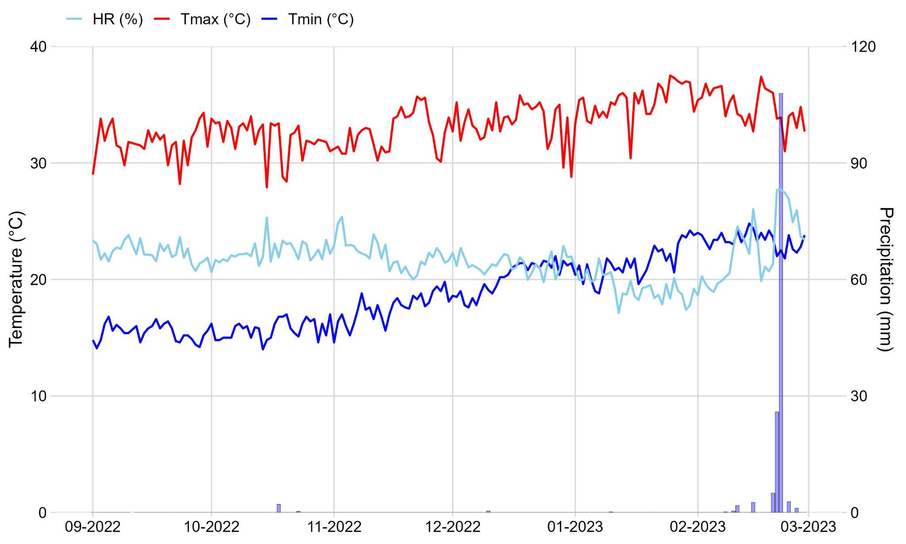
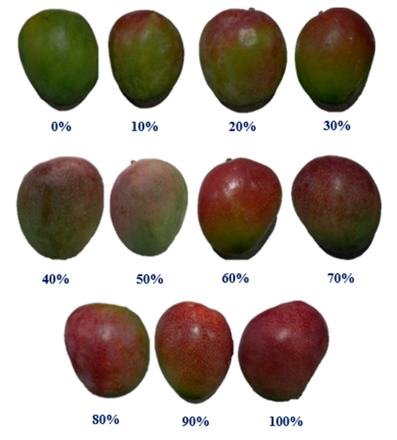

**Impact of Organic Fertilizers on the Quality of Mango (*Mangifera indica* L.) var. 'Kent' During Physiological and Commercial Maturity.** 

Henry Morocho-Romero^1,2†^; Ricardo Peña-Castillo^2†^; Arturo Morales-Pizarro^2†.^; Junior Domínguez Chozo^2^; Sandy Vilchez-Navarro^1,2^, Sebastian Casas-Niño^1^; Gabriela Cárdenas-Huamán^1^; Nery Tirabante Terrones^1^; Esdwin-Oberti Nuñez-Ticliahuanca^1^; Ana Montañez-Artica^1^; Leslie Velarde-Apaza^1^; Max Ramirez-Rojas^1^; Juancarlos Cruz^1^; Flavio Lozano-Isla^1,3#^.

*^1^ Dirección de Supervisión y Monitoreo en las Estaciones Experimentales Agrarias, Instituto Nacional de Innovación Agraria. Lima. Perú.*

*^2^ Universidad Nacional de Piura, Campus Universitario s/n. Urb. Miraflores. Piura, Perú.*

*^3^ Facultad de Ingeniería y Ciencias Agrarias, Universidad Nacional Toribio Rodríguez de Mendoza de Amazonas (UNTRM), Chachapoyas, Peru*

* ^†^ Equal contributing author.*

* ^#^ *Corresponding author: [flavio.lozano@untrm.edu.pe](mailto:flavio.lozano@untrm.edu.pe) 


ORCID IDs:

Henry Morocho-Romero: [0000-0002-1520-2372](https://orcid.org/0000-0002-1520-2372)

Ricardo Peña-Castillo:[0000-0001-9366-4962](https://orcid.org/0000-0001-9366-4962)

Arturo Morales-Pizarro: [0000-0003-3966-6689](https://orcid.org/0000-0003-3966-6689)

Junior Dominguez Chozo: [0009-0008-4510-5267](https://orcid.org/0009-0008-4510-5267)

Sandy Vilchez-Navarro: [0009-0002-1784-5563](https://orcid.org/0009-0002-1784-5563)

Sebastian Casas-Niño: [0000-0002-6576-8761](https://orcid.org/0000-0002-6576-8761)

Gabriela Cárdenas-Huamán: [0000-0002-8379-5464](https://orcid.org/0000-0002-8379-5464)

Nery Tirabante Terrones: [0000-0002-0634-1522](https://orcid.org/0000-0002-0634-1522)

Edwin-Oberti Nuñez-Ticliahuanca: [0009-0004-4613-0625](https://orcid.org/0009-0004-4613-0625)

Ana Montañez-Artica: [0000-0003-3580-6621](https://orcid.org/0000-0003-3580-6621)

Leslie Velarde-Apaza: [0000-0001-6031-6355](https://orcid.org/0000-0001-6031-6355)

Max Augusto Ramirez-Rojas: 0000-0003-3322-0838

Juancarlos Cruz: [0009-0005-8288-2768](https://orcid.org/0009-0005-8288-2768)

Flavio Lozano-Isla: [0000-0002-0714-669X](https://orcid.org/0000-0002-0714-669X)


# Abstract

Mango (Mangifera indica L.) is a key fruit crop in Peru, yet its reliance on chemical fertilizers raises concerns about fruit quality and environmental sustainability. This study assessed the impact of organic fertilizers—compost and biol—on the quality of 'Kent' mangoes at physiological and commercial maturity stages. Conducted during the 2022–2023 season, the experiment used a 3 × 3 factorial design with compost applied at 0, 5, and 10 t/ha and biol at 0, 5, and 10%, plus a chemically fertilized control. Results revealed significant compost-biol interactions. At physiological maturity, treatments T6–T8 improved pulp color, soluble solids, titratable acidity, and dry matter content, achieving a desirable yellow pulp (2.0 on the scale), 9.29 °Brix, 1.23% acidity, and 20.96% dry matter—surpassing the control. At commercial maturity, these treatments also enhanced fruit firmness (4.33 kgf/cm²), reduced acidity (0.47%), increased pulp pH (4.69), and intensified orange pulp color. Overall, organic fertilization, particularly higher compost and biol doses, significantly improved fruit quality parameters compared to conventional chemical management. These findings highlight the potential of integrating organic amendments to promote sustainable mango cultivation while maintaining or enhancing fruit quality, thus providing a viable alternative for eco-friendly nutrient management in mango orchards.


**Keywords:** agricultural practices; crop productivity; fruit quality; nutrient management; sustainable farming

# Introduction

Mango *(Mangifera indica L.)* is a seasonal tropical fruit with growing global demand due to its unique sensory attributes and well-documented health benefits [[1,2]](https://www.zotero.org/google-docs/?zJAjlD). However, in recent years, climate change has exacerbated phytosanitary challenges and disrupted key physiological processes, adversely affecting mango production and marketability [[3,4]](https://www.zotero.org/google-docs/?zqfzV0). Among the most commercially significant mango cultivars is ‘Kent’, developed in Florida, USA, in 1932 from seeds of the ‘Brooks’ variety [[5]](https://www.zotero.org/google-docs/?Xmh0v2). This cultivar is recognized for its oval shape, sweet flavor, low fiber content, and dark green skin with red hues that intensify as ripening progresses [[6]](https://www.zotero.org/google-docs/?TVSZS8).  


Mango ripening involves two critical stages: physiological maturity and commercial maturity. These stages are accompanied by a series of morphological, physiological, and biochemical changes that ultimately influence fruit quality [[7–9]](https://www.zotero.org/google-docs/?hsYYxV). Physiological maturity in mango corresponds to BBCH scale stage 87 [[10]](https://www.zotero.org/google-docs/?us8ElS), marked by growth cessation, lenticel formation, purine coating, and starch accumulation  [[11,12]](https://www.zotero.org/google-docs/?6QLG5S). In contrast, commercial maturity aligns with stage 89 of the BBCH scale  [[10]](https://www.zotero.org/google-docs/?Sinf4d) and is characterized by chlorophyll degradation, carotenoid accumulation, cell wall softening, and polysaccharide breakdown [[13–15]](https://www.zotero.org/google-docs/?JXkwSg). While fruit maturity is traditionally assessed through subjective criteria such as shoulder width, shape, lenticel size, and skin color [[16–18]](https://www.zotero.org/google-docs/?PSiFgN), these methods are prone to errors due to varietal variability [[19]](https://www.zotero.org/google-docs/?KlDAcd). Consequently, objective approaches based on physical, physiological, and biochemical parameters - are necessary to reliably assess fruit quality [[20–22]](https://www.zotero.org/google-docs/?HTsj5p).


In the "Kent" cultivar, fruit quality is linked to both qualitative traits such as internal color and pulp hue and quantitative traits such as weight, volume [[18]](https://www.zotero.org/google-docs/?YS65nF), pulp firmness [[23]](https://www.zotero.org/google-docs/?RmPQBi), soluble solids content, titratable acidity [[16]](https://www.zotero.org/google-docs/?pqjpIZ), ethylene production, and dehydration rates [[23]](https://www.zotero.org/google-docs/?eEj6VJ). Fruit maturation is influenced by intrinsic factors like genotype and extrinsic factors including water availability, temperature, light, hormone production, and nutrient supply [[4,24]](https://www.zotero.org/google-docs/?TKu53u). Nutrient availability, in particular, plays a key role during fruit development, helping to prevent physiological disorders and nutritional imbalances that compromise harvest and postharvest quality [[25,26]](https://www.zotero.org/google-docs/?QbYvSC). 


In Peru, nutrient management in mango production is traditionally based on synthetic N-P-K-Mg-Ca fertilizers, often supplemented with foliar applications of micronutrients and synthetic hormones to ensure high yields and acceptable fruit quality  [[27,28]](https://www.zotero.org/google-docs/?SD4gUC) . However, recent increases in fertilizer prices have led to yield declines and reduced profitability [[29,30]](https://www.zotero.org/google-docs/?qjuYhf). As a result, many growers have turned to organic fertilizers as cost-effective alternatives that can mitigate the adverse impacts of chemical inputs [[31,32]](https://www.zotero.org/google-docs/?HXgVmO).  


Organic fertilizers, derived from decomposed plant and animal residues, typically have lower nutrient concentrations [[33]](https://www.zotero.org/google-docs/?Tca5WL) but offer a broader spectrum of nutrients and compounds that are released gradually, enhancing soil physical, chemical, and biological properties [[34,35]](https://www.zotero.org/google-docs/?sgMI7x). Their use not only reduces dependence on synthetic fertilizers [[36]](https://www.zotero.org/google-docs/?slz13W) but also improves crop yield and fruit quality [[37,38]](https://www.zotero.org/google-docs/?el7y1Q). Among the most common organic inputs in mango cultivation are compost - applied to the soil in solid form [[39]](https://www.zotero.org/google-docs/?zYnp5o) -  and biol, a liquid biofertilizer applied either to the soil or foliage [[40]](https://www.zotero.org/google-docs/?GcBMz8). 


Soil-applied compost enhances the soil-plant system by increasing root hair density, stimulating soil biota activity, reducing pathogen incidence, and supporting gradual nutrient mineralization [[41–43]](https://www.zotero.org/google-docs/?wPQsMo). Foliar-applied biol contributes micronutrients, phytohormones, and aromatic compounds that trigger morphological and physiological changes in plants, promote tissue elongation, and exert pest-repellent effects [[44–46]](https://www.zotero.org/google-docs/?quzLn7). Previous studies have demonstrated that partial substitution of chemical fertilizers with organic inputs enhances soil properties, improves mango yield, and enriches fruit nutritional quality, including vitamin C content and favorable sugar-to-acid and soluble solids-to-acid ratios [[47–49]](https://www.zotero.org/google-docs/?wXtFpK). Accordingly, the objective of this study was to evaluate the effects of soil- and foliar-applied organic fertilizers - compost and biol - on the quality of ‘Kent’ mango fruits at physiological and commercial maturity. The study was conducted in Tambogrande, Peru, for two years during the 2022–2023 growing season.

# Materials and Methods

## Study Area and Plant Material

This study was conducted from September 2022 to March 2023 (2022–2023 growing season) in an experimental mango plot located in the village of Las Mónicas, Tambogrande district, Piura region, Peru (latitude 4° 54' 45'' S, longitude 80° 16' 9'' W, and elevation 96 m above sea level; [Figure  @fig:id.umhwcapm7kiw]:). 


Climatic conditions during the study period were characterized by minimum temperatures of 14 °C, recorded in October 2022, and maximum temperatures reaching up to 37.5 °C in February 2023. The highest monthly precipitation was also observed in February 2023, with an accumulation of 147.7 mm, which coincided with the highest relative humidity (67.91%). In contrast, the lowest relative humidity (57.94%) occurred in January, aligning with the period of peak temperature ([Figure 2](?tab=t.0#bookmark=kix.izbl1o5okhva)).

{#fig:id.umhwcapm7kiw}


The physical and chemical properties of the soil at the study site were characterized by a sandy texture (68% sand, 16% silt, and 16% clay), a pH of 7.51, organic matter content of 0.96%, and electrical conductivity of 0.18 dS/m. Soil nutrient levels included 480 mg/kg of nitrogen, 25.9 mg/kg of phosphorus, and 268 mg/kg of potassium, with a cation exchange capacity of 10.88 cmol/kg.


The plant material consisted of eight-year-old ‘Kent’ mango *(Mangifera indica L.)* trees, exhibiting vigorous growth, high flowering intensity, good phytosanitary condition, and no signs of alternate bearing. The trees were spaced at 7 × 7 meters and originated from grafted ‘Kent’ scions onto ‘Criollo de Chulucanas’ rootstocks.

{#fig:kix.izbl1o5okhva}

## 

## Experimental Treatments


The experiment was conducted using a 3 × 3 factorial design arranged in a completely randomized block design (CRBD) with three replications. The first factor was the application of compost at rates of 0, 5, and 15 t/ha, and the second factor was the application of biol at concentrations of 0, 5, and 10%, resulting in a total of nine treatment combinations ([Table 1](?tab=t.0#bookmark=id.vv1laf6v8ci2)). Each treatment consisted of five trees, of which three were selected for evaluation. In addition, treatments were compared against a control group, which received conventional fertilization practices commonly used by local farmers in Tambogrande ([Table 2](?tab=t.0#bookmark=id.qdtg22hdvqri)). The control regimen involves the application of synthetic fertilizers to the soil (230 kg/ha N, 220 kg/ha P₂O₅, 280 kg/ha K₂O, 36 kg/ha Ca, and 60 kg/ha MgO) and foliar sprays (90 mg/ha N, 28 mg/ha P₂O₅, 380 mg/ha K₂O, 98 mg/ha Ca, and 100 mg/ha MgO).


The compost and biol application rates were calibrated based on the nutrient equivalence of NPK inputs used in the conventional fertilization system of Tambogrande. For compost, the conventional soil fertilization rate was reduced and increased by 50%, then replaced with equivalent nutrient content in compost, resulting in rates of 5 t/ha and 15 t/ha. Similarly, for biol, the foliar fertilization rate was adjusted by ±50% and replaced with its equivalent concentration in biol, yielding the 5% and 10% application treatments ([Table 2](?tab=t.0#bookmark=id.qdtg22hdvqri)). 


: Summary of compost and biol treatments applied to *Mangifera indica* L. var. 'Kent' mango trees during the 2022-2023 season.  Control treatment involves the common fertilization practices used by local farmers. {#tbl:id.vv1laf6v8ci2}


| **Treatment**              | **Compost Dose (t/ha)**    | **Biol Concentration (%)** | **Code**                    |
|----------------------------|----------------------------|----------------------------|-----------------------------|
| Control Treatment          | 0                          | 0                          | T0                          |
| Treatment 1                | 5                          | 0                          | T1                          |
| Treatment 2                | 15                         | 0                          | T2                          |
| Treatment 3                | 0                          | 5                          | T3                          |
| Treatment 4                | 0                          | 10                         | T4                          |
| Treatment 5                | 5                          | 5                          | T5                          |
| Treatment 6                | 5                          | 10                         | T6                          |
| Treatment 7                | 15                         | 5                          | T7                          |
| Treatment 8                | 15                         | 10                         | T8                          |


The compost used in this study was a commercial product named Compost Nutri Suelo 3M, produced by Soluciones Orgánicas Loma Fértil® in Las Mónicas-CP7, Piura, Peru. It was obtained through aerobic composting of crop residues from maize, sheep or goat manure, fossilized marine algae, rock phosphate, and charcoal husks. The composting process lasted three months and included periodic inoculation with native microorganisms from the Tambogrande region, activated with sugarcane molasses *(Saccharum officinarum).*


: Nutrient contributions per hectare by treatment and application method in the study of *Mangifera indica L*. var. 'Kent'. {#tbl:id.qdtg22hdvqri}


| **Treatment**          | **Application Method** | **N**                  | **P**                  | **K**                  | **Ca**                 | **Mg**                 | **Organic Matter (%)**  |
|------------------------|------------------------|------------------------|------------------------|------------------------|------------------------|------------------------|-------------------------|
| T0                     | Soil                   | 230 kg                 | 220 kg                 | 280 kg                 | 36 kg                  | 60 kg                  | 0                       |
|                        | Foliar                 | 90 mg                  | 28 mg                  | 380 mg                 | 98 mg                  | 100 mg                 | 0                       |
| T1                     | Soil                   | 104.5 kg               | 100.5 kg               | 128 kg                 | 222.5 kg               | 140 kg                 | 28.5                    |
|                        | Foliar                 | 0 mg                   | 0 mg                   | 0 mg                   | 0 mg                   | 0 mg                   | %                       |
| T2                     | Soil                   | 313.5 kg               | 301.5 kg               | 384 kg                 | 667.5 kg               | 420 kg                 | 28.5                    |
|                        | Foliar                 | 0 mg                   | 0 mg                   | 0 mg                   | 0 mg                   | 0 mg                   | 0                       |
| T3                     | Soil                   | 0 kg                   | 0 kg                   | 0 kg                   | 0 kg                   | 0 kg                   | 0                       |
|                        | Foliar                 | 57.16 mg               | 18.605 mg              | 256.2 kg               | 62 mg                  | 72.25 mg               | 2.14                    |
| T4                     | Soil                   | 0 kg                   | 0 kg                   | 0 kg                   | 0 kg                   | 0 kg                   | 0                       |
|                        | Foliar                 | 114.32 mg              | 37.21 mg               | 512.4 mg               | 124 mg                 | 144.5 mg               | 2.14                    |
| T5                     | Soil                   | 104.5 kg               | 100.5 kg               | 128 kg                 | 222.5 kg               | 140 kg                 | 28.5                    |
|                        | Foliar                 | 57.16 mg               | 18.605 mg              | 256.2 kg               | 62 mg                  | 72.25 mg               | 2.14                    |
| T6                     | Soil                   | 104.5 kg               | 100.5 kg               | 128 kg                 | 222.5 kg               | 140 kg                 | 28.5                    |
|                        | Foliar                 | 114.32 mg              | 37.21 mg               | 512.4 mg               | 124 mg                 | 144.5 mg               | 2.14                    |
| T7                     | Soil                   | 313.5 kg               | 301.5 kg               | 384 kg                 | 667.5 kg               | 420 kg                 | 28.5                    |
|                        | Foliar                 | 57.16 mg               | 18.605 mg              | 256.2 kg               | 62 mg                  | 72.25 mg               | 2.14                    |
| T8                     | Soil                   | 313.5 kg               | 301.5 kg               | 384 kg                 | 667.5 kg               | 420 kg                 | 28.5                    |
|                        | Foliar                 | 114.32 mg              | 37.21 mg               | 512.4 mg               | 124 mg                 | 144.5 mg               | 2.14                    |


The biol was prepared manually following the methodology described by Chanduví-García et al [[50]](https://www.zotero.org/google-docs/?DGMrk3), with slight modifications intended to accelerate fermentation. A 200-liter plastic container with a lid and a 60-liter metal pot were used. A 25 kg sack of compost was submerged in 70 liters of irrigation water inside the plastic container. Simultaneously, 6 kg of leaves from native plant species - *Ambrosia peruviana* (altamisa), *Ricinus communis* (castor bean), and *Azadirachta indica* (neem) - were cut into 2 × 2 cm pieces and placed in the metal pot, along with 4 kg of *Allium sativum* (garlic), 4 kg of *Allium cepa* (onion), and 3 kg of *Capsicum annuum* (chili pepper). The mixture was topped with water up to 50 liters and boiled for eight hours, or until partial degradation of the plant materials was observed. Water was periodically added to maintain the original volume during evaporation.

Once cooking was complete, both the supernatant and the residual plant materials were transferred into the plastic container containing the compost mixture. Two liters of *chicha de jora* (a traditional Peruvian fermented maize beverage) were added, and the volume was adjusted to 200 liters with additional water. The container was sealed and left to ferment for 20 days.


The chemical fertilizers used for soil application included diammonium phosphate, potassium sulfate, ammonium sulfate, calcium nitrate, and magnesium sulfate. These were applied in specific proportions to supply the required amounts of nitrogen (N), phosphorus (P), potassium (K), calcium (Ca), and magnesium (Mg) as outlined in [Tabla 2](?tab=t.0#bookmark=id.qdtg22hdvqri). For foliar applications, liquid formulations containing N, P, K, Ca, and Mg were used.


Soil fertilization was performed once, during fruit development, corresponding to phenological stage 71 (ovary growth or first fruit drop) of the BBCH scale for stone fruits [[10]](https://www.zotero.org/google-docs/?tc3EUa). Foliar applications were carried out in three stages: the first coincided with the compost application, the second occurred 15 days later, and the third was performed 20 days after the second. Soil fertilizers were incorporated into the topsoil around the canopy projection of each tree, while foliar fertilizers were applied via foliar spraying, ensuring full leaf coverage.


Fruit harvesting was performed once, following the completion of phenological stage 73 (second fruit drop), based on the BBCH scale [[10]](https://www.zotero.org/google-docs/?5W0a0k). Ten fruits per tree were randomly selected and labeled using two different colors to distinguish between stages: five fruits were designated for evaluation at physiological maturity and five for commercial maturity, totaling 15 fruits per treatment. Fruit selection prioritized those located on the outer canopy at heights above 1.5 meters from the ground. Harvesting was conducted between 06:00 and 10:00 a.m. to avoid post-harvest exposure to direct sunlight.

## Study Variables

The study evaluated a set of quantitative parameters to assess fruit quality at two critical developmental stages: physiological maturity (BBCH stage 87 for stone fruits) and commercial maturity (BBCH stage 89). These objective measurements were preferred over subjective criteria - such as shoulder width, size, and skin color - which are often error-prone. To assess the quality of ‘Kent’ mango fruit, the evaluation criteria were based on the Peruvian Technical Standard NTP 011.010:2020. 


According to this standard, fruits at physiological maturity should meet the following criteria: weight between 167–1250 g, color coverage (blush) greater than 50%, firmness between 11–16 kg/cm², soluble solids content >7 °Brix, yellow pulp color, titratable acidity <4.0%, and dry matter content >18.0% [[51]](https://www.zotero.org/google-docs/?ktzTnT). For commercial maturity, benchmarks were based on the export requirements of Peruvian agro-export companies for air-shipped mangoes, which require pulp firmness between 2–5 kg/cm², soluble solids content >12 °Brix, titratable acidity <1.0%, and pulp color ranging from yellow to orange [[52,53]](https://www.zotero.org/google-docs/?3nSNiB). 


At the physiological maturity stage, several key quality variables were assessed. Peel color coverage (PFCC, %) was estimated using a custom-developed color reference chart (Figure S1), which quantified the percentage of carotenoid expression on the mango peel. Fruit firmness (FF, kg/cm²) was measured using a Bosch FT 327 penetrometer, which determines the force required for a 1 cm² plunger to penetrate the pulp [[54]](https://www.zotero.org/google-docs/?BbTJby). Pulp color (FPC) was evaluated based on a visual color scale specifically developed for this study (Figure S2). Additional biochemical parameters, including soluble solids content (SSCF, °Brix), pulp pH (FpH), titratable acidity (TAF, %), and dry matter percentage (FDMP, %), were determined following standard protocols outlined by the Association of Official Analytical Chemists [[55]](https://www.zotero.org/google-docs/?UwAYSY), specifically methods 932.12, 981.12, 942.15, and 963.15. Lastly, the physiological maturity index (FPMI) was calculated by dividing the soluble solids content by titratable acidity, serving as an integrated indicator of fruit ripeness and flavor balance.


Variables at commercial maturity were evaluated after subjecting the fruits to a standardized postharvest ripening process, adapted from Zamora-Cienfuegos et al [[56]](https://www.zotero.org/google-docs/?mXQ5aN). In this method, fruits were ripened without continuous refrigeration or ethylene application. Initially, mangoes were stored at 13 ± 1 °C for two days. They were then transferred to a closed ripening room for 12 hours, where ambient temperatures rose above 26 ± 2 °C. After this period, the room was ventilated for 12 hours to release CO₂ emitted by the fruits. This cycle was repeated daily for five days until fruits reached commercial maturity.


Upon completion of the ripening process, the Fruit Dehydration Percentage (FDP, %) was calculated by comparing fruit weight before and after ripening. In addition, the following quality parameters were reassessed using the same protocols as for physiological maturity: Firmness (FF, kg/cm²), Pulp Color (FPC), Soluble Solids Content (SSCF, °Brix), pH (FpH), Titratable Acidity (TAF, %), and the Commercial Maturity Index (FCMI), calculated as the SSCF/TAF ratio.

## 

## 

## Statistical Analysis


A linear mixed-effects model was employed to evaluate treatment effects, providing increased robustness against potential deviations from the assumptions of normality and homogeneity of variances [[57]](https://www.zotero.org/google-docs/?jYyzRC). Subsequently, a univariate analysis of variance (ANOVA) was conducted under a factorial design to identify significant differences among treatment combinations. Mean comparisons were performed using Tukey’s Honestly Significant Difference (HSD) test at a significance level of α = 0.05, implemented via the *emmeans package* [[58]](https://www.zotero.org/google-docs/?vr2bY2). To explore multivariate relationships among the measured variables, principal component analysis (PCA) was conducted using the FactoMineR package [[59]](https://www.zotero.org/google-docs/?wlMamW) with visualizations generated using *factoextra* [[60]](https://www.zotero.org/google-docs/?9H3jRA). Correlation matrices were visualized with the corrplot package [[61]](https://www.zotero.org/google-docs/?BU7uZX). All statistical analyses were performed using R software, version 4.4.1 [[62]](https://www.zotero.org/google-docs/?Vpq3HC). The code and the reproducible analysis is provided in Supplementary File 2.

# Results

## Fruit Quality Traits at Physiological Maturity

To assess the fruit quality characteristics at the physiological maturity stage ([Figure  @fig:kix.jeoh8ws8urib]:), a univariate analysis was performed on key variables, including fruit firmness (FF), percentage of fruit canopy color (PFCC), internal fruit color (FPC), soluble solids content (SSCF), titratable acidity (TAF), and dry matter percentage (FDMP). These variables are essential for determining physiological maturity at harvest, as outlined in the Peruvian Technical Standard NTP 011.010:2020. Their evaluation also plays a critical role in reducing the risk of postharvest damage during handling, transportation, and processing [[63,64]](https://www.zotero.org/google-docs/?uXWLFS). 

![Quality traits of *Mangifera indica L*. var. 'Kent' mango fruits at physiological maturity. (a) Fruit firmness (FF), (b) Percentage of fruit canopy color (PFCC), (c) Fruit pulp color (FPC), (d) Soluble solids content (SSCF, °Brix), (e) Titratable acidity (TAF, %), and (f) Fruit dry matter percentage (FDMP, %). Different uppercase letters indicate statistically significant differences among compost treatments, while different lowercase letters indicate significant differences among biol treatments, based on Tukey’s multiple comparison test (p < 0.05). Error bars represent standard errors from post hoc analysis. Treatments consisted of combinations of compost (t/ha) and biol (%) as follows: 0-0 (T0), 5-0 (T1), 15-0 (T2), 0-5 (T3), 0-10 (T4), 5-5 (T5), 5-10 (T6), 15-5 (T7), and 15-10 (T8). Treatment T0 corresponds to conventional fertilization practices used by farmers in Tambogrande, which include chemical soil fertilization (230 kg/ha N, 220 kg/ha P₂O₅, 280 kg/ha K₂O, 36 kg/ha Ca, and 60 kg/ha MgO) and foliar fertilization (90 mg/ha N, 28 mg/ha P₂O₅, 380 mg/ha K₂O, 98 mg/ha Ca, and 100 mg/ha MgO). Data analysis was based on 405 individual fruit samples (n = 405).](img_2.jpg){#fig:kix.jeoh8ws8urib}

For fruit firmness (FF), no statistically significant interaction was observed between compost and biol treatments (p = 0.68; [Figure 3](?tab=t.0#bookmark=kix.jeoh8ws8urib)a). However, significant differences were detected for each factor individually. Among biol concentrations, the 10% application resulted in the highest firmness values across all compost levels, with a mean of 12.48 kg/cm². Similarly, the 15 t/ha compost dose produced slightly higher firmness compared to other compost treatments, averaging 12.43 kg/cm². Although the interaction was not significant, Treatment T8 yielded the highest firmness at 13.00 kg/cm², significantly outperforming the control (T0), which recorded 11.40 kg/cm²  (Figure S3).


Regarding peel fruit canopy color (PFCC), no significant interaction was found between compost and biol (p = 0.89; [Figure 3](?tab=t.0#bookmark=kix.jeoh8ws8urib)b). Nonetheless, both factors independently influenced PFCC. The 10% biol treatment produced the highest peel color coverage across compost levels, with an average of 73.86%. Similarly, the 15 t/ha compost treatment resulted in an average PFCC of 73.73%. The highest recorded value was in Treatment T8 (78.70%), which was statistically superior to the control (T0), which had 56.40% (Figure S3).


In contrast, a significant interaction effect was observed for fruit pulp color (FPC) (p < 0.001; [Figure 3](?tab=t.0#bookmark=kix.jeoh8ws8urib)c). indicating that the effect of one factor depended on the level of the other (non-parallel lines). Treatment T8 achieved a pulp color score of 2.5, corresponding to a yellow hue on the custom color scale (Figure S2), and was statistically superior to the control (Figure S3).


A significant interaction was also detected for soluble solids content (SSCF) (p = 0.01; [Figure 3](?tab=t.0#bookmark=kix.jeoh8ws8urib)d). Treatments T6 and T7 both reached 9.29 °Brix, significantly higher than the control (T0), which recorded 8.57 °Brix (Figure S3). The confidence intervals for T6 and T7 partially overlapped, indicating statistical equivalence between these two treatments


For titratable acidity (TAF), a significant interaction between compost and biol was also found (p = 0.01; [Figure 3](?tab=t.0#bookmark=kix.jeoh8ws8urib)e). Treatment T8 exhibited the lowest acidity at 1.24%, significantly less than T0, which recorded the highest acidity at 1.37% (Figure S3). Notably, fruits treated with 10% biol showed consistently lower acidity across compost levels.


Finally, for fruit dry matter percentage (FDMP), no significant interaction was observed (p = 0.57; [Figure 3](?tab=t.0#bookmark=kix.jeoh8ws8urib)f). Nonetheless, Treatment T8 again demonstrated statistical superiority, with a dry matter content of 21.00%, compared to 19.76% in the control (T0) (Figure S3). It is worth noting that fruits treated with 10% biol exhibited higher dry matter content regardless of compost application rate.


To further analyze the relationships among the quality variables and organic fertilizer treatments at physiological maturity, a principal component analysis (PCA) was conducted, accompanied by a Pearson correlation matrix ([Figure  @fig:id.lorxrx2m0tsw]:).

```Unknown element type at this position: UNSUPPORTED```

![Principal Component Analysis (PCA) of quality traits for mango fruits at physiological maturity from compost and biol applications. (a) Distribution of physicochemical traits: percentage of fruit canopy cover (PFCC, %), fruit firmness (FF, kg/cm^2^), fruit pulp color (FPC), soluble solids content of the fruit (SSCF, ºBrix), fruit pH (FpH), titratable acidity of the fruit (TAF, %), fruit dry matter percentage (FDMP, %), fruit physiological maturity index (FPMI). (b) Distribution of treatments based on combinations of compost (t/ha) and biol (%), including: 0-0 (T0), 5-0 (T1), 15-0 (T2), 0-5 (T3), 0-10 (T4), 5-5 (T5), 5-10 (T6), 15-5 (T7), and 15-10 (T8). Treatment T0 represents the conventional fertilization system used by farmers in Tambogrande, consisting of chemical soil fertilization (230 kg/ha N, 220 kg/ha P₂O₅, 280 kg/ha K₂O, 36 kg/ha Ca, and 60 kg/ha MgO) and foliar fertilization (90 mg/ha N, 28 mg/ha P₂O₅, 380 mg/ha K₂O, 98 mg/ha Ca, and 100 mg/ha MgO). Analysis was based on 405 samples (n = 405).](img_3.jpg){#fig:id.lorxrx2m0tsw}


```Unknown element type at this position: UNSUPPORTED```To evaluate the overall interactions among fruit quality traits and their responses to organic fertilizer treatments, a principal component analysis (PCA) was conducted ([Figure 4](?tab=t.0#bookmark=id.lorxrx2m0tsw)). The first two principal components explained a cumulative variance of 94.50%, with Dimension 1 accounting for 83.00% and Dimension 2 for 11.50% of the total variability ([Figure 4](?tab=t.0#bookmark=id.lorxrx2m0tsw)a). Within Dimension 1, the variables fruit firmness (FF), physiological maturity index (FPMI), and peel fruit canopy color (PFCC) showed the highest contributions - 14.49%, 14.21%, and 14.00%, respectively - while pulp color (FPC) contributed less (4.97%). In Dimension 2, FPC was the dominant contributor at 71.87%, while PFCC and titratable acidity (TAF) had the lowest contributions, at 0.31% and 2.06%, respectively. The variables FF, FPMI, FDMP, SSCF, and TAF were identified as the most influential in explaining fruit quality at physiological maturity.


The PCA biplot ([Figure 4](?tab=t.0#bookmark=id.lorxrx2m0tsw)a) illustrated strong positive relationships among FF, FDMP, SSCF, FPMI, FPC, FpH, and PFCC, whereas TAF showed an inverse relationship. Specifically, FF exhibited a strong positive correlation (r = 0.97) with Dimension 1, while TAF was strongly negatively correlated (r = –0.93), highlighting their opposing contributions to fruit quality along the main component. For Dimension 2, FPC displayed a strong positive correlation (r = 0.81), further emphasizing its importance in color development at maturity.


In terms of treatment positioning within the PCA space, the conventional fertilization treatment (T0) aligned closely with the TAF vector, indicating that this treatment was associated with higher fruit acidity ([Figure 4](?tab=t.0#bookmark=id.lorxrx2m0tsw)). In contrast, Treatment T8 showed the strongest association with FPC, reflecting the most intense pulp coloration - specifically yellow - indicative of greater ripeness and visual appeal. Similarly, T8 also aligned with higher values of FF and FDMP, suggesting that this treatment promoted fruits with greater firmness and dry matter content, traits that are desirable for improving postharvest handling and commercial shelf-life. Furthermore, variables such as SSCF, FPMI, and FpH increased progressively with treatments T5 through T8, indicating that higher compost and biol doses enhanced sweetness, maturity index, and overall flavor quality.

## 

## Fruit Quality Traits at Commercial Maturity


To assess fruit quality at the commercial maturity stage, a univariate analysis was performed on key postharvest attributes, including fruit firmness (FF), soluble solids content (SSCF), titratable acidity (TAF), fruit dehydration percentage (FDP), pulp pH (FpH), and fruit pulp color (FPC). These variables are widely used by Peruvian mango export companies and serve as critical indicators for determining commercial maturity during postharvest handling [[65,66]](https://www.zotero.org/google-docs/?rnMSUZ).

![Quality characteristics of Mangifera indica L. var. ‘Kent’ fruit at commercial maturity. (a) Fruit firmness (FF); (b) Soluble solids content (SSCF); (c) Titratable acidity (TAF); (d) Fruit dehydration percentage (FDP); (e) Fruit pH (FpH); and (f) Fruit pulp color (FPC). Different uppercase letters indicate statistically significant differences between compost treatments, and different lowercase letters indicate differences between biol treatments, based on Tukey’s multiple comparison test at a significance level of p < 0.05. Error bars represent the standard error derived from post hoc analysis. Treatments represent combinations of compost (t/ha) and biol (%) as follows: 0-0 (T0), 5-0 (T1), 15-0 (T2), 0-5 (T3), 0-10 (T4), 5-5 (T5), 5-10 (T6), 15-5 (T7), and 15-10 (T8). Treatment T0 corresponds to conventional fertilization commonly used by farmers in Tambogrande, consisting of chemical soil fertilization (230 kg/ha N, 220 kg/ha P₂O₅, 280 kg/ha K₂O, 36 kg/ha Ca, and 60 kg/ha MgO) and foliar fertilization (90 mg/ha N, 28 mg/ha P₂O₅, 380 mg/ha K₂O, 98 mg/ha Ca, and 100 mg/ha MgO). The analysis was based on 135 fruit samples (n = 135).](img_4.jpg){#fig:id.apkbyaf8rnn2}


Significant differences were observed in fruit firmness (FF) as a result of the interaction between compost and biol applications (p = 0.03; [Figure 5](?tab=t.0#bookmark=id.apkbyaf8rnn2)a). Treatments T8, T7, T6, and T5 showed significantly higher firmness values compared to the control (T0), with Treatment T8 exhibiting the highest mean firmness at 4.33 kg/cm² (Figure S4).


For soluble solids content (SSCF), no significant interaction between compost and biol was detected (p = 0.91; [Figure 5](?tab=t.0#bookmark=id.apkbyaf8rnn2)b). However, the 10% biol application consistently promoted higher °Brix values across all compost levels, and similarly, the 15 t/ha compost dose outperformed lower compost doses across biol levels. Despite the absence of interaction, Treatment T8 achieved the highest SSCF at 16.12 °Brix, significantly exceeding the control (T0, Figure S4).


Regarding titratable acidity (TAF), a highly significant interaction effect was found (p < 0.001; [Figure 5](?tab=t.0#bookmark=id.apkbyaf8rnn2)c). Treatment T8 produced the lowest acidity (0.47%), which was significantly lower than that of the control (0.62%) (Figure S4). Compost at 15 t/ha resulted in consistently lower acidity across all biol levels, with all values statistically lower than the control.


For fruit dehydration percentage (FDP), no significant interaction was found (p = 0.40; [Figure 5](?tab=t.0#bookmark=id.apkbyaf8rnn2)d), though differences were evident among individual treatment levels. In particular, treatments without biol (0%) exhibited the highest dehydration, averaging 6.58%. Although the interaction was not significant, Treatment T8 had the lowest dehydration rate at 6.16%, statistically lower than the control (Figure S4).


A significant interaction was observed for fruit pulp pH (FpH) (p < 0.001; [Figure 5](?tab=t.0#bookmark=id.apkbyaf8rnn2)e). Treatment T8 exhibited the highest mean pH value at 4.69, which was significantly greater than that of the control group (Figure S4).


Lastly, fruit pulp color (FPC) also showed a highly significant interaction effect (p < 0.001; [Figure 5](?tab=t.0#bookmark=id.apkbyaf8rnn2)f). The highest color intensity score was recorded for Treatment T8, with a value of 3.8 on the visual scale, corresponding to an intense orange hue. This treatment was significantly superior to the control, which had lower color development (Figure S4).


To further explore trait interrelationships and treatment effects across organic fertilizer dosages, a principal component analysis (PCA) and Pearson correlation analysis were conducted ([Figure  @fig:id.awvbghja6kxt]:).

```Unknown element type at this position: UNSUPPORTED```

![Principal Component Analysis (PCA) of quality traits for mango fruits at commercial maturity under compost and biol applications. (a) Distribution of physicochemical traits: fruit dehydration percentage (FDP, %), fruit firmness (FF, kg/cm²), fruit pulp color (FPC), soluble solids content at commercial maturity (SSCF, °Brix), fruit pH (FpH), titratable acidity (TAF, %), and fruit commercial maturity index (FCMI). (b) Distribution of treatments based on combinations of compost (t/ha) and biol (%), including: 0-0 (T0), 5-0 (T1), 15-0 (T2), 0-5 (T3), 0-10 (T4), 5-5 (T5), 5-10 (T6), 15-5 (T7), and 15-10 (T8). Treatment T0 represents the conventional fertilization system used by farmers in Tambogrande, consisting of chemical soil fertilization (230 kg/ha N, 220 kg/ha P₂O₅, 280 kg/ha K₂O, 36 kg/ha Ca, and 60 kg/ha MgO) and foliar fertilization (90 mg/ha N, 28 mg/ha P₂O₅, 380 mg/ha K₂O, 98 mg/ha Ca, and 100 mg/ha MgO). Analysis was based on 405 individual fruit measurements (n = 135).](img_5.jpg){#fig:id.awvbghja6kxt}


```Unknown element type at this position: UNSUPPORTED```To explore the interaction of fruit quality traits at commercial maturity, a principal component analysis (PCA) was performed ([Figure 6](?tab=t.0#bookmark=id.awvbghja6kxt)). The first two dimensions explained a cumulative variance of 95.20%, with Dimension 1 accounting for 84.80% and Dimension 2 for 10.40% of the total variance ([Figure 6](?tab=t.0#bookmark=id.awvbghja6kxt)a). Within Dimension 1, fruit dehydration percentage (FDP) and soluble solids content (SSCF) were the main contributors, with contributions of 16.06% and 16.24%, respectively, followed by fruit pulp color (FPC) at 8.50%. In Dimension 2, FPC contributed the most (64.34%), while FDP and SSCF had minimal influence, at 1.57% and 0.49%, respectively. Overall, the traits FDP, SSCF, FPC, titratable acidity (TAF), fruit pH (FpH), and fruit firmness (FF) made the most substantial contributions, reflecting their importance in defining commercial fruit maturity and market readiness.


The PCA biplot ([Figure 6](?tab=t.0#bookmark=id.awvbghja6kxt)a). revealed strong positive correlations among SSCF, FPC, FpH, and FF, indicating that these attributes tend to increase together. In contrast, FDP and TAF showed negative correlations with these variables. Specifically, SSCF showed a strong positive correlation (r = 0.98) along Dimension 1, while FDP had a strong negative correlation (r = –0.98), confirming their opposing influence on fruit quality. For Dimension 2, FPC showed a moderate positive correlation (r = 0.68), highlighting its relevance in explaining color variation at this maturity stage.


Treatment positioning within the PCA space reflected quality trait expression. Treatments T0 and T3 were aligned with the FDP and TAF vectors, indicating that fruits from these treatments had higher dehydration and acidity - traits that negatively affect commercial quality. High acidity can reduce fruit palatability, while greater dehydration is associated with weight loss and reduced firmness, as FF and FDP vectors are oppositely oriented ([Figure 6](?tab=t.0#bookmark=id.awvbghja6kxt)). Additionally, FPC was positioned opposite T0, suggesting that conventional fertilization results in less vibrant pulp coloration. Since orange and orange-yellow hues are associated with consumer-preferred ripe fruits, this indicates a lower visual appeal in T0 fruits. In contrast, treatments T5, T6, T7, and T8 clustered along the direction of FF, SSCF, and FpH vectors, indicating that higher doses of compost and biol enhanced firmness, sweetness, and pH-traits that improve postharvest handling, consumer acceptance, and flavor quality.

# Discussion

Mango is one of Peru’s most important horticultural exports, with over 60% of national production destined for international markets such as the Netherlands, the United States, Spain, and the Republic of Korea [[67]](https://www.zotero.org/google-docs/?G6g5us). Given the increasing demand for sustainable production practices, the use of organic fertilizers and bio-based molecules has gained attention for their potential to enhance yield and fruit quality [[68,69]](https://www.zotero.org/google-docs/?pAkl0Y). This study evaluated the effects of soil- and foliar-applied organic fertilizers - compost and biol - on the physicochemical quality of ‘Kent’ mango fruit, using mature, eight-year-old trees under field conditions. Fruit quality was assessed at two critical developmental stages - physiological and commercial maturity - providing a comprehensive view of how organic inputs influence both pre- and postharvest performance.

## 

## Mango Quality at Physiological Maturity


In this study, the quality of ‘Kent’ mango fruit at physiological maturity was assessed using key parameters including fruit firmness (FF), peel fruit canopy color (PFCC), pulp color (FPC), soluble solids content (SSCF), titratable acidity (TAF), and fruit dry matter percentage (FDMP). Although no significant interaction was detected between compost and biol applications for FF and PFCC ([Figure 3](?tab=t.0#bookmark=kix.jeoh8ws8urib)a and 3b), treatments T8, T7, and T6 consistently yielded the highest values and were statistically superior to the conventional control (T0) (Figure S3). These findings contrast with those of  Marco Antonio et al [[70]](https://www.zotero.org/google-docs/?qcp5BN), who found no significant differences in fruit firmness during physiological maturity when comparing mango trees fertilized with organic inputs, chemical fertilizers, or left unfertilized (Tukey p < 0.05). Nevertheless, all treatments in this study met the firmness criteria set by the Peruvian Technical Standard NTP 011.010:2020 for ‘Kent’ mango (11–16 kg/cm²), suggesting compliance with quality standards regardless of treatment. The observed improvements in firmness may be attributed to the presence of potassium, calcium, and magnesium in the compost and biol treatments ([Table 2](?tab=t.0#bookmark=id.qdtg22hdvqri)), as these nutrients are known to promote homogalacturonan accumulation, pectin cross-linking, and phospholipid biosynthesis, all of which contribute to cell wall structure and firmness [[71–73]](https://www.zotero.org/google-docs/?DZRigH). Firmer fruits are also associated with extended shelf-life and improved postharvest handling [[66]](https://www.zotero.org/google-docs/?qMPtYm). 


Regarding PFCC, all treatments exceeded the >50% coverage threshold established by NTP 011.010:2020. Although the compost × biol interaction was not statistically significant, treatments T8 through T5 resulted in significantly higher PFCC values compared to T0 (Figure S3), suggesting that organic fertilizers enhance skin coloration. However, this finding diverges from Kanzaki et al [[74]](https://www.zotero.org/google-docs/?rU9s5k), who indicated that red coloration in mango peel is primarily influenced by genetic background and environmental factors such as sun exposure. Aesthetically, red coloration enhances consumer preference and marketability [[74–76]](https://www.zotero.org/google-docs/?jP5FAT), and it is associated with the accumulation of anthocyanins - compounds that also improve resistance to chilling and pathogens [[76–78]](https://www.zotero.org/google-docs/?BcUSCp). 


Significant interactions between compost and biol were observed for FPC, SSCF, and FDMP ([Figure 3](?tab=t.0#bookmark=kix.jeoh8ws8urib)c,d y f). Treatments T8, T7, and T6 were statistically superior to the control (T0) (Figure S3). These results partially contradict Marco Antonio et al [[70]](https://www.zotero.org/google-docs/?N1JJzf), who found no significant differences in SSCF among fruits treated with organic, conventional, or no fertilization. In contrast, Mahadeen [[79]](https://www.zotero.org/google-docs/?8Tj0pk) and Kilic et al [[80]](https://www.zotero.org/google-docs/?pFTsmt) reported increased soluble solids in organically grown fruits. In the present study, the high potassium content in treatments ([Table 2](?tab=t.0#bookmark=id.qdtg22hdvqri)) likely facilitated the translocation of photoassimilates and activation of starch-hydrolyzing enzymes, thus enhancing soluble solids accumulation [[81–83]](https://www.zotero.org/google-docs/?hTZMuG). All treatments surpassed the SSCF threshold of >7.0 °Brix required by NTP 011.010:2020.


Similarly, the dry matter content (FDMP) was higher in treatments T8 through T5 compared to the control (Figure S3), consistent with the findings of Okba et al [[81]](https://www.zotero.org/google-docs/?jThvEF), who reported elevated dry matter in organically fertilized fruits. Organic fertilizers may enhance vegetative growth and carbohydrate accumulation by stimulating microbial activity and nutrient cycling [[84]](https://www.zotero.org/google-docs/?RvUYLD).  As dry matter content reflects carbohydrate accumulation during fruit development, it serves as an indirect indicator of maturity and internal quality [[1,85,86]](https://www.zotero.org/google-docs/?IbXIj2). 


For pulp color (FPC), only Treatment T8 was statistically superior to the control (Figure S3), although all treatments produced fruits with yellow pulp, as required by NTP 011.010:2020. This supports findings by Maldonado-Celis et al [[1]](https://www.zotero.org/google-docs/?EYucHq), who noted that pulp and skin color are reliable indicators of mango maturity, though they vary by cultivar. Moreover, Lechaudel et al [[87]](https://www.zotero.org/google-docs/?n24NVe) observed that fruit position within the canopy affects pulp color, with interior fruits exhibiting greener tones compared to exterior ones.


Titratable acidity (TAF) showed a significant interaction between compost and biol ([Figure 3](?tab=t.0#bookmark=kix.jeoh8ws8urib)e), with treatments T8 through T5 producing significantly lower acidity than the control (Figure S3). These results are consistent with Abdel-Sattar et al [[88]](https://www.zotero.org/google-docs/?22ZQKp)  and Kilic et al [[80]](https://www.zotero.org/google-docs/?Az0saa), who reported reduced acidity in fruits grown with organic fertilizers. All treatments in this study met the acidity requirement of <4.0% set by NTP 011.010:2020. Lower acidity is favorable for flavor development, as it facilitates the conversion of organic acids into sugars, thereby increasing SSCF and improving sweetness [[88,89]](https://www.zotero.org/google-docs/?SO9Fob).  

## Mango Quality at Commercial Maturity.

At the commercial maturity stage, mango undergoes critical physicochemical changes reflected in quality parameters such as fruit firmness (FF), soluble solids content (SSCF), titratable acidity (TAF), fruit dehydration percentage (FDP), pH (FpH), and pulp color (FPC). In this study, SSCF and FDP showed no significant interaction between compost and biol ([Figure 5](?tab=t.0#bookmark=id.apkbyaf8rnn2)b, 5d), yet treatments T8, T7, and T6 produced the highest values, significantly outperforming the control (T0) (Figure S4). These findings are consistent with Marco Antonio et al [[70]](https://www.zotero.org/google-docs/?YFPMnF), who reported that organically fertilized mangoes at commercial maturity had higher SSCF compared to those grown with chemical fertilizers or without fertilization. In our case, all treatments exceeded the 12 °Brix minimum required by Peruvian agro-exporters, highlighting the effectiveness of organic inputs.


This aligns with Sun et al [[90]](https://www.zotero.org/google-docs/?er2PFS), who reported that sugar accumulation in fruit is influenced by fertilization, water availability, and the translocation of photoassimilates. Other authors have noted that SSCF depends on cultivar and is largely the result of starch hydrolysis into simple sugars during ripening [[91,92]](https://www.zotero.org/google-docs/?gtgfAH). Postharvest handling practices - such as temperature control, ethylene application, and edible coatings - also affect SSCF and fruit quality [[26,93,94]](https://www.zotero.org/google-docs/?oks4v0). 


For FDP, fruits from the control treatment (T0) experienced significantly higher dehydration compared to those treated with T8, T7, T6 and T5 (Figure S4). Although no direct relationship has been established between organic fertilization and reduced dehydration, previous studies suggest that fruit weight loss during postharvest storage is influenced by peel thickness, transpiration rate, and respiration [[95,96]](https://www.zotero.org/google-docs/?XCKjiB). Additionally, climatological conditions and postharvest practices play a major role in fruit dehydration [[25,97]](https://www.zotero.org/google-docs/?eMkFbP).


FF, FpH, and FPC all showed significant compost × biol interaction effects ([Figure 5](?tab=t.0#bookmark=id.apkbyaf8rnn2)a, 5c, 5e, 5f), with treatments T8, T7, and T6 performing best (Figure S4). This contrasts with findings by Marco Antonio et al [[70]](https://www.zotero.org/google-docs/?xByZo8), who observed greater firmness in unfertilized fruits during commercial maturity. All treatments in our study, however, fell within the optimal firmness range (2–5 kgf/cm²) required for commercial export. The presence of calcium in all fertilized treatments may explain these results, given its known role in enzymatic activity, membrane stabilization, and delayed softening [[64,91]](https://www.zotero.org/google-docs/?kzoObi). Firmness loss and dehydration are natural outcomes of the climacteric ripening process, and when well-managed, they indicate proper fruit maturation [[93]](https://www.zotero.org/google-docs/?jMdyIo).


Increased FpH and improved pulp coloration observed in organically treated fruits may be explained by potassium and calcium-mediated enzymatic activity during ripening [[98,99]](https://www.zotero.org/google-docs/?N5NaaQ). However, pulp color and pH are also influenced by storage time and postharvest handling [[100,101]](https://www.zotero.org/google-docs/?Pz5PYS). Edible coatings containing wax or calcium salts can enhance color development and slow senescence [[82,93]](https://www.zotero.org/google-docs/?lqUq21). 


TAF values were lowest in treatments T8, T7, and T6, statistically below the control (T0) (Figure S4). Although the exact mechanism is not fully clear, this reduction may be attributed to increases in SSCF, as sugar accumulation is often accompanied by a decline in organic acid content [[91]](https://www.zotero.org/google-docs/?EG1uAx). All treatments met the export requirement of <1.0% acidity. Other studies suggest that acidity loss may also be due to cytosolic oxidation during fruit ripening [[102,103]](https://www.zotero.org/google-docs/?NQPukb). Conversely, Haider et al [[104]](https://www.zotero.org/google-docs/?3tNop7) reported that calcium can delay organic acid degradation, helping preserve acidity longer. Importantly, lower acidity improves mango palatability and is valued for processed products such as juices, jams, and desserts. 


Although organic fertilizers demonstrated favorable effects on fruit quality at both physiological and commercial maturity, these improvements cannot be solely attributed to organic inputs. The control treatment - based on chemical fertilization - also supplied essential nutrients such as potassium, calcium, and magnesium. In addition, fruit quality is influenced by cultivar, climatic conditions, phytosanitary status, and broader agronomic practices [[105]](https://www.zotero.org/google-docs/?Z3w0HZ).


Nevertheless, organic fertilization contributes to long-term sustainability, in contrast to synthetic fertilizers. Compost and biol enhance soil physical, chemical, and biological properties  [[106]](https://www.zotero.org/google-docs/?kNRvOh), ensuring a more stable nutrient supply [[107]](https://www.zotero.org/google-docs/?Xfbjwq). Key quality-related nutrients such as potassium, calcium, and magnesium are released gradually, promoting fruit development and postharvest quality [[66,73,82]](https://www.zotero.org/google-docs/?bgkAxv). Organic fertilization also supports circular agriculture through crop residue recycling and opens new market opportunities given the growing global demand for organic products [[108,109]](https://www.zotero.org/google-docs/?U3UpdO).


Although the present study provides valuable insights into sustainable mango production practices, future research should incorporate post-harvest soil analyses to better quantify nutrient uptake by mango trees from organic amendments and chemical fertilizers. This would contribute to a more comprehensive understanding of nutrient dynamics under different fertilization regimes. It is also recommended to include foliar nutrient analyses before and after fertilization as a complementary diagnostic tool to assess the nutritional status of the crop. Such data would support the development of more precise and efficient organic fertilization strategies tailored to the specific needs of the mango plant.


Furthermore, long-term studies evaluating the effects of compost and biol across diverse agroecological zones are warranted, particularly considering variability in soil properties and climatic conditions. Lastly, the application of advanced technologies for assessing internal and external fruit color is encouraged, as these approaches could improve the accuracy of fruit ripening assessment and carotenoid accumulation under organic management systems.

# Conclusions

The combined application of compost and biol significantly improved fruit quality parameters of mango cv. 'Kent' at both physiological and commercial maturity stages. Our findings indicate that treatments involving 15 t/ha of compost combined with 5% and 10% biol, as well as 5 t/ha of compost with 10% biol, were the most effective. These treatments enhanced soluble solids content and dry matter accumulation at physiological maturity, while increasing firmness and pH at commercial maturity. Additionally, they exerted positive effects on pulp internal color and fruit acidity at both maturity stages. The combined use of compost and biol proved to be an effective alternative to conventional fertilization, contributing to improved fruit quality while fostering environmentally sustainable production practices. These results are particularly relevant for optimizing mango production systems in regions such as Piura, Peru, and offer valuable guidance for growers aiming to meet export quality standards and sustainability goals. Overall, organic fertilization emerges as a viable strategy to support high-quality fruit production, while preserving soil health and reducing dependency on synthetic inputs.

# 

**Statements and Declarations**

**Author Contributions**

Conceptualization, H.M-R., R.P-C. and A.M-P.; methodology, A.M-P. and J.D-C.; formal analysis, F.L-I. and S.C-N.; investigation, H.M-R.; resources H.M-R.; data curation, F.L-I. and S.C-N.; writing—original draft preparation, H.M-R., S.V-N., G.C-H., N.T-T., E-O.N-T., A.M-A., F.L-I. and S.C-N.; writing—review and editing, F.L-I. and L.V-A.; visualization, F.L-I. and S.C-N.; supervision, J.C. and M.R-R.; funding acquisition, J.C. All authors have read and agreed to the published version of the manuscript.

**Funding**

This work was funded by the company 'Soluciones Orgánicas Loma Fértil,' Piura-Peru, and the National Institute of Agricultural Innovation (INIA), Peru through the investment project N°. 2472190 'El Chira'.

**Data Availability**

The original contributions presented in this study are included in the article and supplementary material. The reproducible data analysis and datasets are available in Supplementary File 2 and can be accessed through the GitHub repository at [https://github.com/Sebass96/prochira\_abonos\_mango](https://github.com/Sebass96/prochira_abonos_mango) 

**Acknowledgments**

The authors want to thank Mr. L. Córdova C. for his support in fieldwork and technical management of the crop. To Eng. C.P. Roque V. for his contribution to the postharvest management of mango

**Conflicts of Interest**

The authors declare no conflict of interest.

# References

[1. 	Maldonado-Celis, M.E.; Yahia, E.M.; Bedoya, R.; Landázuri, P.; Loango, N.; Aguillón, J.; Restrepo, B.; Guerrero Ospina, J.C. Chemical Composition of Mango (*Mangifera Indica* L.) Fruit: Nutritional and Phytochemical Compounds. *Front. Plant Sci.* **2019**, *10*, 1073, doi:10.3389/fpls.2019.01073.](https://www.zotero.org/google-docs/?Xqsy4g)

[2. 	Yahia, E.M.; Ornelas-Paz, J.D.J.; Brecht, J.K.; García-Solís, P.; Maldonado Celis, M.E. The Contribution of Mango Fruit (*Mangifera Indica* L.) to Human Nutrition and Health. *Arab. J. Chem.* **2023**, *16*, 104860, doi:10.1016/j.arabjc.2023.104860.](https://www.zotero.org/google-docs/?Xqsy4g)

[3. 	Makhmale, S.; Bhutada, P.; Yadav, L.; Yadav, Y. Impact of Climate Change on Phenology of Mango– The Case Study. **2016**.](https://www.zotero.org/google-docs/?Xqsy4g)

[4. 	Raju, C.; Pazhanivelan, S.; Perianadar, I.V.; Kaliaperumal, R.; Sathyamoorthy, N.K.; Sendhilvel, V. Climate Change as an Existential Threat to Tropical Fruit Crop Production—A Review. *Agriculture* **2024**, *14*, 2018, doi:10.3390/agriculture14112018.](https://www.zotero.org/google-docs/?Xqsy4g)

[5. 	*Tropical and Subtropical Fruit Crops: Production, Processing, and Marketing*; Mandal, D., Wermund, U., Phavaphutanon, L., Cronje, R., Eds.; Innovations in horticultural science; First edition.; Apple Academic Press: Palm Bay, FL burlington, ON, 2023; ISBN 978-1-003-30503-3.](https://www.zotero.org/google-docs/?Xqsy4g)

[6. 	Mirza, B.; Croley, C.R.; Ahmad, M.; Pumarol, J.; Das, N.; Sethi, G.; Bishayee, A. Mango (*Mangifera Indica* L.): A Magnificent Plant with Cancer Preventive and Anticancer Therapeutic Potential. *Crit. Rev. Food Sci. Nutr.* **2021**, *61*, 2125–2151, doi:10.1080/10408398.2020.1771678.](https://www.zotero.org/google-docs/?Xqsy4g)

[7. 	Lalel, H.J.D.; Singh ,Zora; Tan ,S. C.; and Agustí, M. Maturity Stage at Harvest Affects Fruit Ripening, Quality and Biosynthesis of Aroma Volatile Compounds in ‘Kensington Pride’ Mango. *J. Hortic. Sci. Biotechnol.* **2003**, *78*, 225–233, doi:10.1080/14620316.2003.11511610.](https://www.zotero.org/google-docs/?Xqsy4g)

[8. 	Thanaraj, T.; Terry, L.A.; Bessant, C. Chemometric Profiling of Pre-Climacteric Sri Lankan Mango Fruit (*Mangifera Indica* L.). *Food Chem.* **2009**, *112*, 786–794, doi:10.1016/j.foodchem.2008.06.040.](https://www.zotero.org/google-docs/?Xqsy4g)

[9. 	Thiruchelvam, T.; Landahl, S.; Terry, L.A. Temporal Variation of Volatile Compounds from Sri Lankan Mango (*Mangifera Indica* L.) Fruit during Ripening. *J. Agric. Food Res.* **2020**, *2*, 100053, doi:10.1016/j.jafr.2020.100053.](https://www.zotero.org/google-docs/?Xqsy4g)

[10. 	Meier, U. Etapas de desarrollo de las plantas monocotiledóneas y dicotiledóneas: BBCH Monografia. **2018**, doi:10.5073/20180906-075743.](https://www.zotero.org/google-docs/?Xqsy4g)

[11. 	Joas, J.; Vulcain, E.; Desvignes, C.; Morales, E.; Léchaudel, M. Physiological Age at Harvest Regulates the Variability in Postharvest Ripening, Sensory and Nutritional Characteristics of Mango ( *Mangifera Indica* L.) Cv. Coghshall Due to Growing Conditions. *J. Sci. Food Agric.* **2012**, *92*, 1282–1290, doi:10.1002/jsfa.4696.](https://www.zotero.org/google-docs/?Xqsy4g)

[12. 	Thakur, R.R.; Mangaraj, S.; Kate, A.E.; Sami, R.; Al-Mushhin, A.A.M.; Maklad, M.F.; Uguru, H.; Helal, M. Effect of Harvesting Stages and Storage Temperature on Quality Attributes and Post-Harvest Shelf-Life of Mango ( *Mangifera Indica* ). *J. Biobased Mater. Bioenergy* **2022**, *16*, 770–782, doi:10.1166/jbmb.2022.2219.](https://www.zotero.org/google-docs/?Xqsy4g)

[13. 	Yashoda, H.M.; Prabha, T.N.; Tharanathan, R.N. Mango Ripening: Changes in Cell Wall Constituents in Relation to Textural Softening. *J. Sci. Food Agric.* **2006**, *86*, 713–721, doi:10.1002/jsfa.2404.](https://www.zotero.org/google-docs/?Xqsy4g)

[14. 	Hossain, Md.A.; Rana, Md.M.; Kimura, Y.; Roslan, H.A. Changes in Biochemical Characteristics and Activities of Ripening Associated Enzymes in Mango Fruit during the Storage at Different Temperatures. *BioMed Res. Int.* **2014**, *2014*, 1–11, doi:10.1155/2014/232969.](https://www.zotero.org/google-docs/?Xqsy4g)

[15. 	Martínez-González, M.E.; Balois Morales, R.; Alia-Tejacal, I.; Cortes-Cruz, M.A.; Palomino-Hermosillo, Y.A.; López-Gúzman, G.G. Postcosecha de Frutos: Maduración y Cambios Bioquímicos. *Rev. Mex. Cienc. Agríc.* **2017**, 4075–4087, doi:10.29312/remexca.v0i19.674.](https://www.zotero.org/google-docs/?Xqsy4g)

[16. 	Jha, S.N.; Kingsly, A.R.P.; Chopra, S. Physical and Mechanical Properties of Mango during Growth and Storage for Determination of Maturity. *J. Food Eng.* **2006**, *72*, 73–76, doi:10.1016/j.jfoodeng.2004.11.020.](https://www.zotero.org/google-docs/?Xqsy4g)

[17. 	Wanitchang, P.; Terdwongworakul, A.; Wanitchang, J.; Nakawajana, N. Non-Destructive Maturity Classification of Mango Based on Physical, Mechanical and Optical Properties. *J. Food Eng.* **2011**, *105*, 477–484, doi:10.1016/j.jfoodeng.2011.03.006.](https://www.zotero.org/google-docs/?Xqsy4g)

[18. 	Abu, M.; Olympio, N.S.; Darko, J.O. Determination of Harvest Maturity for Mango (*Mangifera Indica* L.) Fruit by Non-Destructive Criteria. *Agric. Sci.* **2021**, *12*, 1103–1118, doi:10.4236/as.2021.1210071.](https://www.zotero.org/google-docs/?Xqsy4g)

[19. 	Prasad, K.; Jacob, S.; Siddiqui, M.W. Fruit Maturity, Harvesting, and Quality Standards. In *Preharvest Modulation of Postharvest Fruit and Vegetable Quality*; Elsevier, 2018; pp. 41–69 ISBN 978-0-12-809807-3.](https://www.zotero.org/google-docs/?Xqsy4g)

[20. 	Sudheer, K.P.; Indira, V. *Post Harvest Technology of Horticultural Crops*; New India Publishing Agency: Pitam Pura, New Delhi, 2007; ISBN 978-93-89547-06-1.](https://www.zotero.org/google-docs/?Xqsy4g)

[21. 	Benkeblia, N.; Tennant, D.P.F.; Jawandha, S.K.; Gill, P.S. Preharvest and Harvest Factors Influencing the Postharvest Quality of Tropical and Subtropical Fruits. In *Postharvest Biology and Technology of Tropical and Subtropical Fruits*; Elsevier, 2011; pp. 112–142e ISBN 978-1-84569-733-4.](https://www.zotero.org/google-docs/?Xqsy4g)

[22. 	Gonzalez-Aguilar, G.A.; Kader, A.A.; Brecht, J.K.; Toivonen, P.M.A. Fresh-Cut Tropical and Subtropical Fruit Products. In *Postharvest Biology and Technology of Tropical and Subtropical Fruits*; Elsevier, 2011; pp. 381–419e ISBN 978-1-84569-733-4.](https://www.zotero.org/google-docs/?Xqsy4g)

[23. 	Muiruri, J.; Ambuko, J.; Nyankanga, R.; Owino, W. Maturity Indices of Specific Mango Varieties Produced at Medium Altitude Agro-Ecological Zone in Kenya. *Afr. J. Food Agric. Nutr. Dev.* **2022**, *22*, 20752–20773, doi:10.18697/ajfand.111.22025.](https://www.zotero.org/google-docs/?Xqsy4g)

[24. 	Liu, B.; Xin, Q.; Zhang, M.; Chen, J.; Lu, Q.; Zhou, X.; Li, X.; Zhang, W.; Feng, W.; Pei, H.; et al. Research Progress on Mango Post-Harvest Ripening Physiology and the Regulatory Technologies. *Foods* **2022**, *12*, 173, doi:10.3390/foods12010173.](https://www.zotero.org/google-docs/?Xqsy4g)

[25. 	Mditshwa, A.; Khaliq, G.; Hussein, Z.; Ejaz, S. Editorial: Sustainable Postharvest Management Practices for Fresh Produce. *Front. Sustain. Food Syst.* **2023**, *7*, 1143759, doi:10.3389/fsufs.2023.1143759.](https://www.zotero.org/google-docs/?Xqsy4g)

[26. 	*Sustainable Postharvest Technologies for Fruits and Vegetables*; Ali, S., Mir, S.A., Dar, B.N., Ejaz, S., Eds.; First edition.; CRC Press, Taylor & Francis Group: Boca Raton London New York, 2025; ISBN 978-1-003-37037-6.](https://www.zotero.org/google-docs/?Xqsy4g)

[27. 	Umar, U.D.; Ahmed, N.; Zafar, M.Z.; Rehman, A.; Naqvi, S.A.H.; Zulfiqar, M.A.; Malik, M.T.; Ali, B.; Saleem, M.H.; Marc, R.A. Micronutrients Foliar and Drench Application Mitigate Mango Sudden Decline Disorder and Impact Fruit Yield. *Agronomy* **2022**, *12*, 2449, doi:10.3390/agronomy12102449.](https://www.zotero.org/google-docs/?Xqsy4g)

[28. 	Asis, C.A.; Tilbrook, J.; Anson, D.; Niscioli, A.; Guinto, D.; Bristow, M.; Rowlings, D. Nitrogen Level Impacting Fruit Yield and Quality of Mango in Northern Tropical Australia. *Sustainability* **2024**, *17*, 80, doi:10.3390/su17010080.](https://www.zotero.org/google-docs/?Xqsy4g)

[29. 	Wu, G.; Yang, S.; Luan, C.; Wu, Q.; Lin, L.; Li, X.; Che, Z.; Zhou, D.; Dong, Z.; Song, H. Partial Organic Substitution for Synthetic Fertilizer Improves Soil Fertility and Crop Yields While Mitigating N2O Emissions in Wheat-Maize Rotation System. *Eur. J. Agron.* **2024**, *154*, 127077, doi:10.1016/j.eja.2023.127077.](https://www.zotero.org/google-docs/?Xqsy4g)

[30. 	Vos, R.; Glauber, J.; Hebebrand, C.; Rice, B. Global Shocks to Fertilizer Markets: Impacts on Prices, Demand and Farm Profitability. *Food Policy* **2025**, *133*, 102790, doi:10.1016/j.foodpol.2024.102790.](https://www.zotero.org/google-docs/?Xqsy4g)

[31. 	Parihar, P.; Sharma, S. Composting: A Better Alternative of Chemical Fertilizer. *IOP Conf. Ser. Earth Environ. Sci.* **2021**, *795*, 012038, doi:10.1088/1755-1315/795/1/012038.](https://www.zotero.org/google-docs/?Xqsy4g)

[32. 	Shimelis, G.; Kim, D.-G.; Yimer, F.; Tadesse, M. Exploring Compost Production Potential and Its Economic Benefits and Greenhouse Gas Mitigation in Addis Ababa, Ethiopia. *Sci. Total Environ.* **2024**, *955*, 176617, doi:10.1016/j.scitotenv.2024.176617.](https://www.zotero.org/google-docs/?Xqsy4g)

[33. 	Shaji, H.; Chandran, V.; Mathew, L. Organic Fertilizers as a Route to Controlled Release of Nutrients. In *Controlled Release Fertilizers for Sustainable Agriculture*; Elsevier, 2021; pp. 231–245 ISBN 978-0-12-819555-0.](https://www.zotero.org/google-docs/?Xqsy4g)

[34. 	Jurado, M.M.; Suárez-Estrella, F.; López, M.J.; Vargas-García, M.C.; López-González, J.A.; Moreno, J. Enhanced Turnover of Organic Matter Fractions by Microbial Stimulation during Lignocellulosic Waste Composting. *Bioresour. Technol.* **2015**, *186*, 15–24, doi:10.1016/j.biortech.2015.03.059.](https://www.zotero.org/google-docs/?Xqsy4g)

[35. 	Guo, X.; Liu, H.; Wu, S. Humic Substances Developed during Organic Waste Composting: Formation Mechanisms, Structural Properties, and Agronomic Functions. *Sci. Total Environ.* **2019**, *662*, 501–510, doi:10.1016/j.scitotenv.2019.01.137.](https://www.zotero.org/google-docs/?Xqsy4g)

[36. 	Wang, X.; Yang, Y.; Zhao, J.; Nie, J.; Zang, H.; Zeng, Z.; Olesen, J.E. Yield Benefits from Replacing Chemical Fertilizers with Manure under Water Deficient Conditions of the Winter Wheat – Summer Maize System in the North China Plain. *Eur. J. Agron.* **2020**, *119*, 126118, doi:10.1016/j.eja.2020.126118.](https://www.zotero.org/google-docs/?Xqsy4g)

[37. 	Zhang, J.; Zhuang, M.; Shan, N.; Zhao, Q.; Li, H.; Wang, L. Substituting Organic Manure for Compound Fertilizer Increases Yield and Decreases NH3 and N2O Emissions in an Intensive Vegetable Production Systems. *Sci. Total Environ.* **2019**, *670*, 1184–1189, doi:10.1016/j.scitotenv.2019.03.191.](https://www.zotero.org/google-docs/?Xqsy4g)

[38. 	Serri, F.; Souri, M.K.; Rezapanah, M. Growth, Biochemical Quality and Antioxidant Capacity of Coriander Leaves under Organic and Inorganic Fertilization Programs. *Chem. Biol. Technol. Agric.* **2021**, *8*, 33, doi:10.1186/s40538-021-00232-9.](https://www.zotero.org/google-docs/?Xqsy4g)

[39. 	Weber, J.; Kocowicz, A.; Bekier, J.; Jamroz, E.; Tyszka, R.; Debicka, M.; Parylak, D.; Kordas, L. The Effect of a Sandy Soil Amendment with Municipal Solid Waste (MSW) Compost on Nitrogen Uptake Efficiency by Plants. *Eur. J. Agron.* **2014**, *54*, 54–60, doi:10.1016/j.eja.2013.11.014.](https://www.zotero.org/google-docs/?Xqsy4g)

[40. 	Allouzi, M.M.A.; Allouzi, S.M.A.; Keng, Z.X.; Supramaniam, C.V.; Singh, A.; Chong, S. Liquid Biofertilizers as a Sustainable Solution for Agriculture. *Heliyon* **2022**, *8*, e12609, doi:10.1016/j.heliyon.2022.e12609.](https://www.zotero.org/google-docs/?Xqsy4g)

[41. 	Sánchez-Hernández, R.; Vásquez-Montiel, L.; Valdés-Velarde, E.; Mendoza-Palacios, J.D.D.; López-Noverola, U.; Escamilla-Prado, E. Cambios Edáficos Provocados Por El Uso de Abonos de Origen Natural En Una Región Cafetalera de Veracruz, México. *Rev. TERRA Latinoam.* **2019**, *37*, 351, doi:10.28940/terra.v37i4.515.](https://www.zotero.org/google-docs/?Xqsy4g)

[42. 	Campos Mariscal, J.L.; Álvarez Sánchez, M.E.; Maldonado Torres, R.; Vargas Gustavo, A. Aplicación de Abonos Orgánicos En El Rendimiento y Desarrollo Radicular En El Cultivo de Aguacate. *Rev. Mex. Cienc. Agríc.* **2020**, *11*, 263–274, doi:10.29312/remexca.v11i2.2301.](https://www.zotero.org/google-docs/?Xqsy4g)

[43. 	Díaz-Chuquizuta, P.; Hidalgo-Melendez, E.; Cabrejo-Sánchez, C.; Valdés-Rodríguez, O.A. Respuesta del Maíz (*Zea mays* L.) a la aplicación foliar de abonos orgánicos líquidos. *Chil. J. Agric. Anim. Sci.* **2022**, *38*, 144–153, doi:10.29393/CHJAA38-14RMPO40014.](https://www.zotero.org/google-docs/?Xqsy4g)

[44. 	Chew, K.W.; Chia, S.R.; Yen, H.-W.; Nomanbhay, S.; Ho, Y.-C.; Show, P.L. Transformation of Biomass Waste into Sustainable Organic Fertilizers. *Sustainability* **2019**, *11*, 2266, doi:10.3390/su11082266.](https://www.zotero.org/google-docs/?Xqsy4g)

[45. 	Liu, J.; Shu, A.; Song, W.; Shi, W.; Li, M.; Zhang, W.; Li, Z.; Liu, G.; Yuan, F.; Zhang, S.; et al. Long-Term Organic Fertilizer Substitution Increases Rice Yield by Improving Soil Properties and Regulating Soil Bacteria. *Geoderma* **2021**, *404*, 115287, doi:10.1016/j.geoderma.2021.115287.](https://www.zotero.org/google-docs/?Xqsy4g)

[46. 	Liu, H.; Li, J.; Li, X.; Zheng, Y.; Feng, S.; Jiang, G. Mitigating Greenhouse Gas Emissions through Replacement of Chemical Fertilizer with Organic Manure in a Temperate Farmland. *Sci. Bull.* **2015**, *60*, 598–606, doi:10.1007/s11434-014-0679-6.](https://www.zotero.org/google-docs/?Xqsy4g)

[47. 	Jiao, Y.; Sun, X.; Dong, X.; Yin, J.; Li, Z.; Zhang, K.; Altaf, M.M.; Li, D.; Zhu, Z. Enhancing Mango Yield and Soil Health with Organic and Slow-Release Fertilizers: A Multifaceted Evaluation. *Sci. Total Environ.* **2024**, *951*, 175297, doi:10.1016/j.scitotenv.2024.175297.](https://www.zotero.org/google-docs/?Xqsy4g)

[48. 	Feng, H.D.; Chen, H.Y.; Dang, Zh.G.; Ni, B.; He, C.C.; Wei, Zh.Y.; Chen, Y.Y. SOIL PROPERTIES, LEAF NUTRIENTS AND FRUIT QUALITY RESPONSE TO SUBSTITUTING CHEMICAL FERTILIZER WITH ORGANIC MANURE IN A MANGO ORCHARD. *Appl. Ecol. Environ. Res.* **2020**, *18*, 4025–4033, doi:10.15666/aeer/1803\_40254033.](https://www.zotero.org/google-docs/?Xqsy4g)

[49. 	Abd El-Rahman, A. Response of Mango Trees to Mineral, Bio-Organic Fertilizers and Growth Stimulants. *J. Plant Prod.* **2021**, *12*, 981–986, doi:10.21608/jpp.2021.202613.](https://www.zotero.org/google-docs/?Xqsy4g)

[50. 	Chanduvi-García, R.; Sandoval-Panta, M.A.; Peña-Castillo, R.; Javier Alva, J.; Álvarez, L.Á.; Quiroz-Calderón, M.V.; Granda-Wong, C.; Aguilar-Anccota, R.; Galecio-Julca, M.; Morales-Pizarro, D.A. Biofertilizante y su Correlación entre Parámetros Productivos y de Calidad en Limón Sutil (Citrus aurantifolia Swingle). *Rev. TERRA Latinoam.* **2023**, *41*, doi:10.28940/terra.v41i0.1685.](https://www.zotero.org/google-docs/?Xqsy4g)

[51. 	Ministerio de Economía y Finanzas Resolución Jefatural N.° 251-2021-PERÚ COMPRAS Available online: https://www.gob.pe/institucion/perucompras/normas-legales/2604907-251-2021-peru-compras (accessed on 12 June 2025).](https://www.zotero.org/google-docs/?Xqsy4g)

[52. 	Asociación Peruana de Productores y Exportadores de Mango Manual de buenas prácticas de cosecha y post-cosecha en mango 2021.](https://www.zotero.org/google-docs/?Xqsy4g)

[53. 	Asociación Peruana de Productores y Exportadores de Mango Manual de manejo agronómico de plantaciones del mango peruano 2021.](https://www.zotero.org/google-docs/?Xqsy4g)

[54. 	Baloch, M.K.; Bibi, F. Effect of Harvesting and Storage Conditions on the Post Harvest Quality and Shelf Life of Mango (*Mangifera Indica* L.) Fruit. *South Afr. J. Bot.* **2012**, *83*, 109–116, doi:10.1016/j.sajb.2012.08.001.](https://www.zotero.org/google-docs/?Xqsy4g)

[55. 	*Official Methods of Analysis*; Association of Official Analytical Chemists, Ed.; Food Science Text Series; 18th ed.; Springer International Publishing: Washington, DC, USA, 2005; ISBN 0-935584-77-3.](https://www.zotero.org/google-docs/?Xqsy4g)

[56. 	Zamora-Cienfuegos, E.; S.-García, H.; Montes-de Oca, M.M.; Tovar-Gómez, B. Aceleración de La Maduración En Mango ‘Kent’ Refrigerado. *Rev. Fitotec. Mex.* **2022**, *27*, 359, doi:10.35196/rfm.2004.4.359.](https://www.zotero.org/google-docs/?Xqsy4g)

[57. 	Schielzeth, H.; Dingemanse, N.J.; Nakagawa, S.; Westneat, D.F.; Allegue, H.; Teplitsky, C.; Réale, D.; Dochtermann, N.A.; Garamszegi, L.Z.; Araya‐Ajoy, Y.G. Robustness of Linear Mixed‐effects Models to Violations of Distributional Assumptions. *Methods Ecol. Evol.* **2020**, *11*, 1141–1152, doi:10.1111/2041-210X.13434.](https://www.zotero.org/google-docs/?Xqsy4g)

[58. 	Searle, S.R.; Speed, F.M.; Milliken, G.A. Population Marginal Means in the Linear Model: An Alternative to Least Squares Means. *Am. Stat.* **1980**, *34*, 216–221, doi:10.1080/00031305.1980.10483031.](https://www.zotero.org/google-docs/?Xqsy4g)

[59. 	Francois Husson; Josse, J.; Le, S.; Mazet, J. FactoMineR: Multivariate Exploratory Data Analysis and Data Mining 2006, 2.11.](https://www.zotero.org/google-docs/?Xqsy4g)

[60. 	Kassambara, A.; Mundt, F. Factoextra: Extract and Visualize the Results of Multivariate Data Analyses 2016, 1.0.7.](https://www.zotero.org/google-docs/?Xqsy4g)

[61. 	Wei, T.; Simko, V. Corrplot: Visualization of a Correlation Matrix 2010, 0.94.](https://www.zotero.org/google-docs/?Xqsy4g)

[62. 	R Core Team R: A Language and Environment for Statistical Computing. *R Found. Stat. Comput. Vienna Austria* **2024**.](https://www.zotero.org/google-docs/?Xqsy4g)

[63. 	Alebidi, A.; Abdel-Sattar, M.; Mostafa, L.Y.; Hamad, A.S.A.; Rihan, H.Z. Synergistic Effects of Applying Potassium Nitrate Spray with Putrescine on Productivity and Fruit Quality of Mango Trees Cv. Ewais. *Agronomy* **2023**, *13*, 2717, doi:10.3390/agronomy13112717.](https://www.zotero.org/google-docs/?Xqsy4g)

[64. 	Kumar, S.; Kaushik, R.A.; Jain, D.; Saini, V.P.; Babu, S.R.; Choudhary, R.; Ercisli, S. Genetic Diversity among Local Mango (*Mangifera Indica*  L.) Germplasm Using Morphological, Biochemical and Chloroplast DNA Barcodes Analyses. *Mol. Biol. Rep.* **2022**, *49*, 3491–3501, doi:10.1007/s11033-022-07186-7.](https://www.zotero.org/google-docs/?Xqsy4g)

[65. 	Saroj, N.; Prasad, K. Assessment of Himalayan Plain Mango Genotypes for Phytochemicals, Biochemical‐nutraceutical Characterisation and Quality Change during Storage Life. *Int. J. Food Sci. Technol.* **2023**, *58*, 3781–3799, doi:10.1111/ijfs.16480.](https://www.zotero.org/google-docs/?Xqsy4g)

[66. 	Saroj, N.; Prasad, K.; Singh, S.K.; Kumar, V.; Maurya, S.; Maurya, P.; Tiwari, R.K.; Lal, M.K.; Kumar, R. Characterization of Bioactive and Fruit Quality Compounds of Promising Mango Genotypes Grown in Himalayan Plain Region. *PeerJ* **2023**, *11*, e15867, doi:10.7717/peerj.15867.](https://www.zotero.org/google-docs/?Xqsy4g)

[67. 	Ministerio de Desarrollo Agrario y Riego Sistema Integrado de Estadistica Agraria Available online: https://siea.midagri.gob.pe/portal/siea\_bi/index.html (accessed on 21 May 2024).](https://www.zotero.org/google-docs/?Xqsy4g)

[68. 	Ma, X.; Wang, J.; Su, M.; Liu, B.; Du, B.; Zhang, Y.; He, L.; Wang, S.; Wu, H. The Link between Mineral Elements Variation and Internal Flesh Breakdown of ‘Keitt’ Mango in a Steep Slope Mountain Area, Southwest China. *Horticulturae* **2022**, *8*, 533, doi:10.3390/horticulturae8060533.](https://www.zotero.org/google-docs/?Xqsy4g)

[69. 	García-Santiago, J.C.; González-Fuentes, J.A.; Rojas-Duarte, A.; Hernández-Pérez, A.; Aureoles-Rodríguez, F.; Martínez-Mares, R. Los Ácidos Húmicos Reducen La Adición de NPK y Mejoran La Calidad de Mango. *Ecosistemas Recur. Agropecu.* **2023**, *10*, doi:10.19136/era.a10n1.3319.](https://www.zotero.org/google-docs/?Xqsy4g)

[70. 	Marco Antonio, T. juarez; David, J.C.; Alberto Enrique, B.R.; Andrés, R.M.; Nain, P.A. Fertilización orgánica en mango: calidad y macronutrientes en frutos. In *ResearchGate*; 2018.](https://www.zotero.org/google-docs/?Xqsy4g)

[71. 	Vásquez – Rojas, E. Las Aplicaciones Foliares de Calcio-Boro y Su Efecto En Calidad Interna e Incidencia Del Rajado de Frutos de Aguaymanto. *Rev. Investig. Agrar.* **2020**, *2*, 37–48, doi:10.47840/ReInA.2.2.842.](https://www.zotero.org/google-docs/?Xqsy4g)

[72. 	Huang, W.; Shi, Y.; Yan, H.; Wang, H.; Wu, D.; Grierson, D.; Chen, K. The Calcium-Mediated Homogalacturonan Pectin Complexation in Cell Walls Contributes the Firmness Increase in Loquat Fruit during Postharvest Storage. *J. Adv. Res.* **2023**, *49*, 47–62, doi:10.1016/j.jare.2022.09.009.](https://www.zotero.org/google-docs/?Xqsy4g)

[73. 	Morales-Meléndez, R.; Arroyo-Ramírez, A.; Camposeco-Montejo, N.; Méndez-López, A.; López-Pérez, M.C. *Ascophyllum Nodosum*  y Nitrato de Calcio Como Bioestimulantes En El Desarrollo y Rendimiento de Cultivo de Tomate. *Cienc. Lat. Rev. Científica Multidiscip.* **2024**, *8*, 1574–1589, doi:10.37811/cl\_rcm.v8i1.9553.](https://www.zotero.org/google-docs/?Xqsy4g)

[74. 	Kanzaki, S.; Ichihi, A.; Tanaka, Y.; Fujishige, S.; Koeda, S.; Shimizu, K. The R2R3-MYB Transcription Factor MiMYB1 Regulates Light Dependent Red Coloration of ‘Irwin’ Mango Fruit Skin. *Sci. Hortic.* **2020**, *272*, 109567, doi:10.1016/j.scienta.2020.109567.](https://www.zotero.org/google-docs/?Xqsy4g)

[75. 	Medlicott, A.P.; Bhogal, M.; Reynolds, S.B. Changes in Peel Pigmentation during Ripening of Mango Fruit (*Mangifera Indica* Var. Tommy Atkins). *Ann. Appl. Biol.* **1986**, *109*, 651–656, doi:10.1111/j.1744-7348.1986.tb03222.x.](https://www.zotero.org/google-docs/?Xqsy4g)

[76. 	Sudheeran, P.K.; Love, C.; Feygenberg, O.; Maurer, D.; Ovadia, R.; Oren-Shamir, M.; Alkan, N. Induction of Red Skin and Improvement of Fruit Quality in ‘Kent’, “Shelly” and ‘Maya’ Mangoes by Preharvest Spraying of Prohydrojasmon at the Orchard. *Postharvest Biol. Technol.* **2019**, *149*, 18–26, doi:10.1016/j.postharvbio.2018.11.014.](https://www.zotero.org/google-docs/?Xqsy4g)

[77. 	Sivankalyani, V.; Feygenberg, O.; Diskin, S.; Wright, B.; Alkan, N. Increased Anthocyanin and Flavonoids in Mango Fruit Peel Are Associated with Cold and Pathogen Resistance. *Postharvest Biol. Technol.* **2016**, *111*, 132–139, doi:10.1016/j.postharvbio.2015.08.001.](https://www.zotero.org/google-docs/?Xqsy4g)

[78. 	Sudheeran, P.K.; Feygenberg, O.; Maurer, D.; Alkan, N. Improved Cold Tolerance of Mango Fruit with Enhanced Anthocyanin and Flavonoid Contents. *Molecules* **2018**, *23*, 1832, doi:10.3390/molecules23071832.](https://www.zotero.org/google-docs/?Xqsy4g)

[79. 	Mahadeen, A. Influence of Organic and Chemical Fertilization on Fruit Yield and Quality of Plastic-House Grown Strawberry. *Jordan J. Agric. Sci.* **2009**, *5*.](https://www.zotero.org/google-docs/?Xqsy4g)

[80. 	Kilic, N.; Burgut, A.; Gündesli, M.A.; Nogay, G.; Ercisli, S.; Kafkas, N.E.; Ekiert, H.; Elansary, H.O.; Szopa, A. The Effect of Organic, Inorganic Fertilizers and Their Combinations on Fruit Quality Parameters in Strawberry. *Horticulturae* **2021**, *7*, 354, doi:10.3390/horticulturae7100354.](https://www.zotero.org/google-docs/?Xqsy4g)

[81. 	Okba, S.K.; Mazrou, Y.; Elmenofy, H.M.; Ezzat, A.; Salama, A.-M. New Insights of Potassium Sources Impacts as Foliar Application on ‘Canino’ Apricot Fruit Yield, Fruit Anatomy, Quality and Storability. *Plants* **2021**, *10*, 1163, doi:10.3390/plants10061163.](https://www.zotero.org/google-docs/?Xqsy4g)

[82. 	Sajid, M.; Haq ,Saeed Ul; Jan ,Abdullah; Noor ,Fahad; Ali ,Qazi Shoaib; Alam ,Mehboob; Zaman ,Akhtar; Shah ,Fawad Ali; Mosa ,Walid F. A.; and Abada, H.S. Effect of Foliar Application with Potassium Nitrate and Copper Sulfate on Fruit Yield and Quality of Pear (*Pyrus Communis* L.) Trees. *Int. J. Fruit Sci.* **2022**, *22*, 759–768, doi:10.1080/15538362.2022.2117263.](https://www.zotero.org/google-docs/?Xqsy4g)

[83. 	Khan, M.N.; Nabi ,Ghulam; Khattak ,Abdul Mateen; Ismail ,Emad A. A.; Awwad ,Fuad A.; Irshad ,Muhammad; Ahmad ,Hijaz; and Suhail, M. Efficacy of Foliar Application of Potassium Nitrate in the Regulation of Photosynthetic Pigments, Sex Expression, Yield and Quality Attributes of Sweet Lime (*Citrus Limmetoids*). *Int. J. Fruit Sci.* **2025**, *25*, 40–51, doi:10.1080/15538362.2025.2519138.](https://www.zotero.org/google-docs/?Xqsy4g)

[84. 	Ye, S.; Peng, B.; Liu, T. Effects of Organic Fertilizers on Growth Characteristics and Fruit Quality in Pear-Jujube in the Loess Plateau. *Sci. Rep.* **2022**, *12*, 13372, doi:10.1038/s41598-022-17342-5.](https://www.zotero.org/google-docs/?Xqsy4g)

[85. 	Anderson, N.T.; Walsh, K.B.; Flynn, J.R.; Walsh, J.P. Achieving Robustness across Season, Location and Cultivar for a NIRS Model for Intact Mango Fruit Dry Matter Content. II. Local PLS and Nonlinear Models. *Postharvest Biol. Technol.* **2021**, *171*, 111358, doi:10.1016/j.postharvbio.2020.111358.](https://www.zotero.org/google-docs/?Xqsy4g)

[86. 	De Freitas, S.T.; Guimarães, Í.T.; Vilvert, J.C.; Do Amaral, M.H.P.; Brecht, J.K.; Marques, A.T.B. Mango Dry Matter Content at Harvest to Achieve High Consumer Quality of Different Cultivars in Different Growing Seasons. *Postharvest Biol. Technol.* **2022**, *189*, 111917, doi:10.1016/j.postharvbio.2022.111917.](https://www.zotero.org/google-docs/?Xqsy4g)

[87. 	Lechaudel, M.; Urban, L.; Joas, J. Chlorophyll Fluorescence, a Nondestructive Method To Assess Maturity of Mango Fruits (Cv. ‘Cogshall’) without Growth Conditions Bias. *J. Agric. Food Chem.* **2010**, *58*, 7532–7538, doi:10.1021/jf101216t.](https://www.zotero.org/google-docs/?Xqsy4g)

[88. 	Abdel-Sattar, M.; Mostafa, L.Y.; Rihan, H.Z. Enhancing Mango Productivity with Wood Vinegar, Humic Acid, and Seaweed Extract Applications as an Environmentally Friendly Strategy. *Sustainability* **2024**, *16*, 8986, doi:10.3390/su16208986.](https://www.zotero.org/google-docs/?Xqsy4g)

[89. 	Soppelsa, S.; Kelderer, M.; Casera, C.; Bassi, M.; Robatscher, P.; Andreotti, C. Use of Biostimulants for Organic Apple Production: Effects on Tree Growth, Yield, and Fruit Quality at Harvest and During Storage. *Front. Plant Sci.* **2018**, *9*, 1342, doi:10.3389/fpls.2018.01342.](https://www.zotero.org/google-docs/?Xqsy4g)

[90. 	Sun, D.; Chen, X.; Zhu, C. Physicochemical Properties and Antioxidant Activity of Pectin from Hawthorn Wine Pomace: A Comparison of Different Extraction Methods. *Int. J. Biol. Macromol.* **2020**, *158*, 1239–1247, doi:10.1016/j.ijbiomac.2020.05.052.](https://www.zotero.org/google-docs/?Xqsy4g)

[91. 	Prasad, K.; Saroj, N.; Singh, S.K.; Pradhan, J.; Prasad, S.S.; Kumar, S.; Maurya, S.; Kumar, A.; Srivastava, R.K.; Tiwari, R.K.; et al. Postharvest Quality and Ripening Behaviour of Un-Explored Genotypes of Himalayan Plain Mango Diversity. *Heliyon* **2024**, *10*, e33247, doi:10.1016/j.heliyon.2024.e33247.](https://www.zotero.org/google-docs/?Xqsy4g)

[92. 	Antunes, T.G.; Souza, D.S.D.; Guariglia, B.A.D.; Silva, D.P.C.D.; Morgado, C.M.A.; Matta, L.M.D.; Corrêa, G.D.C.; Cunha Júnior, L.C. Investigation of the Internal Quality of ‘Palmer’ and ‘Tommy Atkins’ Mangoes by near-Infrared Spectroscopy. *Food Sci. Technol.* **2025**, *45*, doi:10.5327/fst.00417.](https://www.zotero.org/google-docs/?Xqsy4g)

[93. 	Khaliq, G. EFFECTS OF EDIBLE COATINGS ENRICHED WITH CALCIUM CHLORIDE ON PHYSIOLOGICAL, BIOCHEMICAL AND QUALITY RESPONSES OF MANGO (*Mangifera Indica* L. Cv. Choke Anan) FRUIT DURING COLD STORAGE. **2015**, doi:10.13140/RG.2.2.33366.60487.](https://www.zotero.org/google-docs/?Xqsy4g)

[94. 	Ul Haq, Z.; Khaliq ,Ghulam; Irshad ,Asif; El-Beltagi ,Hossam S.; Mahmoud Ismail ,Ahmed; and El-Mogy, M.M. Effect of Beeswax and Lemon Grass Oil on Alternaria Alternata and Post-Harvest Quality of Bitter Gourd during Storage. *N. Z. J. Crop Hortic. Sci.* **2025**, *53*, 384–404, doi:10.1080/01140671.2024.2414802.](https://www.zotero.org/google-docs/?Xqsy4g)

[95. 	Aung, A.M.M.; Sharma\*, R.R.; Sethi, S.; Srivastav, M. Evaluation of Post-Harvest Quality of Some Mango (*Mangifera Indica*) Genotypes during Storage. *Indian J. Agric. Sci.* **2020**, *90*, 585–588, doi:10.56093/ijas.v90i3.101489.](https://www.zotero.org/google-docs/?Xqsy4g)

[96. 	Prasad, K.; Singh, G.; Singh, S.K.; Pradhan, J.; Kumar, U.; Singh, H. Plant Extract and Essential Oil Coating Prolongs Shelf Life and Maintains Keeping Quality of Papaya Fruit during Storage. *J. Food Process. Preserv.* **2022**, *46*, doi:10.1111/jfpp.17015.](https://www.zotero.org/google-docs/?Xqsy4g)

[97. 	Prasad, K.; Sharma, R.R. Salicylic Acid Influences Lenticel Discolouration and Physiological and Biochemical Attributes of Mango (*Mangifera Indica* L.) Fruits. *J. Plant Biochem. Biotechnol.* **2018**, *27*, 293–299, doi:10.1007/s13562-018-0439-9.](https://www.zotero.org/google-docs/?Xqsy4g)

[98. 	Santhosh, S.S.; Chitdeshwari, T. Calcium Influences Biochemical and Antioxidant Enzymatic Activities in Tomato Fruits during Storage. *J. Appl. Biol. Biotechnol.* **2022**, doi:10.7324/JABB.2023.110216.](https://www.zotero.org/google-docs/?Xqsy4g)

[99. 	Polychroniadou, C.; Michailidis, M.; Samiotaki, M.; Adamakis, I.-D.S.; Giannoutsou, E.; Skodra, C.; Karagiannis, E.; Bazakos, C.; Molassiotis, A.; Tanou, G. Understanding the Effect of Calcium in Kiwifruit Ripening and Establishment of Early and Late Response Mechanisms through a Cross-Omics Approach. *Postharvest Biol. Technol.* **2024**, *211*, 112803, doi:10.1016/j.postharvbio.2024.112803.](https://www.zotero.org/google-docs/?Xqsy4g)

[100. 	Ranganathan, K. Determination of Optimum Maturity of Karuthakolumbaan Mango Fruits (*Mangifera Indica* L.) to Reduce Post Harvest Loss Available online: https://www.researchgate.net/publication/291357400\_Determination\_of\_Optimum\_Maturity\_of\_Karuthakolumbaan\_Mango\_Fruits\_Mangifera\_indica\_L\_to\_Reduce\_Post\_Harvest\_Loss (accessed on 19 June 2025).](https://www.zotero.org/google-docs/?Xqsy4g)

[101. 	Begum, L.; Ahmed, M.; Rahman, A.; Rahman, H.; Arfin, S.; Akter, N.; Islam, T. Changes of Postharvest Nutritional Quality and Antioxidant Enzymes in ‘Haribhanga’ Mango by *Aloe Vera* Gel with Chitosan and Coconut Oil Coating During Ambient Storage. *J. Hortic. Res.* **2023**, *31*, 79–96, doi:10.2478/johr-2023-0024.](https://www.zotero.org/google-docs/?Xqsy4g)

[102. 	N’Dri, D.; Calani, L.; Mazzeo, T.; Scazzina, F.; Rinaldi, M.; Del Rio, D.; Pellegrini, N.; Brighenti, F. Effects of Different Maturity Stages on Antioxidant Content of Ivorian Gnagnan (*Solanum Indicum* L.) Berries. *Molecules* **2010**, *15*, 7125–7138, doi:10.3390/molecules15107125.](https://www.zotero.org/google-docs/?Xqsy4g)

[103. 	Nour, V.; Ionica, M.E.; Trandafir, I. Bread Enriched in Lycopene and Other Bioactive Compounds by Addition of Dry Tomato Waste. *J. Food Sci. Technol.* **2015**, *52*, 8260–8267, doi:10.1007/s13197-015-1934-9.](https://www.zotero.org/google-docs/?Xqsy4g)

[104. 	Haider, S.T.-A.; Anjum, M.A.; Shah, M.N.; Hassan, A.U.; Parveen, M.; Danish, S.; Alharbi, S.A.; Alfarraj, S. Deciphering the Effects of Different Calcium Sources on the Plant Growth, Yield, Quality, and Postharvest Quality Parameters of ‘Tomato.’ *Horticulturae* **2024**, *10*, 1003, doi:10.3390/horticulturae10091003.](https://www.zotero.org/google-docs/?Xqsy4g)

[105. 	Ferreira Senhor, R.; Augusto de Souza, P.; Carvalho, J.N. de; Silva, F.L. da; Campos Silva, M. Fatores de pré e pós-colheita que afetam os frutos e hortaliças em pós-colheita. *Rev. Verde Agroecol. E Desenvolv. Sustentável* **2009**, *4*, 3.](https://www.zotero.org/google-docs/?Xqsy4g)

[106. 	Marinari, S.; Masciandaro, G.; Ceccanti, B.; Grego, S. Influence of Organic and Mineral Fertilisers on Soil Biological and Physical Properties. *Bioresour. Technol.* **2000**, *72*, 9–17, doi:10.1016/S0960-8524(99)00094-2.](https://www.zotero.org/google-docs/?Xqsy4g)

[107. 	Khan, M.T.; Aleinikovienė, J.; Butkevičienė, L.-M. Innovative Organic Fertilizers and Cover Crops: Perspectives for Sustainable Agriculture in the Era of Climate Change and Organic Agriculture. *Agronomy* **2024**, *14*, 2871, doi:10.3390/agronomy14122871.](https://www.zotero.org/google-docs/?Xqsy4g)

[108. 	Devianti, D.; Yusmanizar, Y.; Syakur, S.; Munawar, A.A.; Yunus, Y. Organic Fertilizer from Agricultural Waste: Determination of Phosphorus Content Using near Infrared Reflectance. *IOP Conf. Ser. Earth Environ. Sci.* **2021**, *644*, 012002, doi:10.1088/1755-1315/644/1/012002.](https://www.zotero.org/google-docs/?Xqsy4g)

[109. 	Organic Trade Association Perú - Guía Global de Comercio Orgánico Available online: https://globalorganictrade.com/country/peru (accessed on 20 June 2025).](https://www.zotero.org/google-docs/?Xqsy4g)


#| end

**Highlights**

* Application of compost and biol increase mango sweetness at physiological maturity.
* Organic fertilizers improve internal flesh color and mango fruit blush percentage.
* Using compost and biol reduce mango dehydration by 0.6% in postharvest handling.
* Organic fertilizers maintain mango firmness at 4.39 kg/cm² at commercial maturity.


# 

# Supplementary Material 

**Figure S1:** Scale for * ***percentage values of carotenoids, referred to as fruit blush, where 0% indicates the absence of carotenoids in the fruit, whereas values of 10%, 20%, 30%, 40%, 50%, 60%, 70%, 80%, 90%, and 100% indicate the presence of carotenoids. These percentages are based on the portion of the mango fruit located between the ventral shoulder and the dorsal shoulder, with 100% referencing the total region located between the aforementioned parts.

​


**Figure S2:** Scale for values of the pulp color of ripe fruit when subjected to a longitudinal cut between the poles, where the values correspond to a specific color: 1.0 white and green, 1.5 green, 2.0 green and yellow, 2.5 yellow, 3.0 yellow-orange, 3.5 orange, and 4.0 deep orange.

​


```Unknown element type at this position: UNSUPPORTED```**Figure S3:** Quality traits for 'Kent' mango fruit at physiological maturity. (a) Fruit firmness. (b) Percentage of fruit canopy cover. (c) Fruit pulp color. (d) Soluble solids content of the fruit. (e) Titratable acidity of the fruit. (f) Fruit dry matter percentage. Different letters indicate statistically significant differences among treatments, according to Tukey's multiple comparison test at a significance level of p < 0.05. Treatments consisted of combinations of compost (t/ha) and biol (%) as follows: 0-0 (T0), 5-0 (T1), 15-0 (T2), 0-5 (T3), 0-10 (T4), 5-5 (T5), 5-10 (T6), 15-5 (T7), and 15-10 (T8). Treatment T0 corresponds to conventional fertilization practices used by farmers in Tambogrande, which include chemical soil fertilization (230 kg/ha N, 220 kg/ha P₂O₅, 280 kg/ha K₂O, 36 kg/ha Ca, and 60 kg/ha MgO) and foliar fertilization (90 mg/ha N, 28 mg/ha P₂O₅, 380 mg/ha K₂O, 98 mg/ha Ca, and 100 mg/ha MgO). Analysis was based on 405 samples (n = 405).

​

**Figure S4:** Quality characteristics for mango fruit of the ‘Kent’ variety at commercial maturity. (a) Fruit firmness. (b) Soluble solids content of the fruit. (c) Titratable acidity of the fruit. (d) Fruit dehydration percentage. (e) Fruit pH. (f) Fruit pulp color. Different letters indicate statistically significant differences among treatments, according to Tukey's multiple comparison test at a significance level of p < 0.05. Treatments consisted of combinations of compost (t/ha) and biol (%) as follows: 0-0 (T0), 5-0 (T1), 15-0 (T2), 0-5 (T3), 0-10 (T4), 5-5 (T5), 5-10 (T6), 15-5 (T7), and 15-10 (T8). Treatment T0 corresponds to conventional fertilization practices used by farmers in Tambogrande, which include chemical soil fertilization (230 kg/ha N, 220 kg/ha P₂O₅, 280 kg/ha K₂O, 36 kg/ha Ca, and 60 kg/ha MgO) and foliar fertilization (90 mg/ha N, 28 mg/ha P₂O₅, 380 mg/ha K₂O, 98 mg/ha Ca, and 100 mg/ha MgO). Analysis was based on 135 samples (n = 135).

​

**Table S1:** Values of the nutrients, substances, and properties of the Nutri Suelo 3M compost provided by Soluciones Orgánicas Loma Fértil, Peru in the product's technical data sheet.


| **Nutrients**                                   | **Values**                                       |
|-------------------------------------------------|--------------------------------------------------|
| Nitrogen N(%)                                   | 2.09                                             |
| Phosphorus P (%)                                | 2.01                                             |
| Potassium K (%)                                 | 2.56                                             |
| Calcium Ca (%)                                  | 4.45                                             |
| Magnesium Mg (%)                                | 2.80                                             |
| Silicon Si (%)                                  | 12.0                                             |
| Sodium Na (%)                                   | 0.21                                             |
| Iron Fe (%)                                     | 9.50                                             |
| Copper Cu (ppm)                                 | 19.0                                             |
| Zinc Zn (ppm)                                   | 77.0                                             |
| Manganese Mn (ppm)                              | 241.0                                            |
| Boron B (ppm)                                   | 50.0                                             |
| **Substances**                                  | **Values**                                       |
| Humic acids (%)                                 | 3.37                                             |
| Fulvic acids (%)                                | 2.79                                             |
| Humin (%)                                       | 22.34                                            |
| Organic matter (%)                              | 28.50                                            |
| **Characteristics**                             | **Values**                                       |
| pH                                              | 7.0                                              |
| Electrical conductivity (EC) (dS/m)             | 3.17                                             |
| Cation exchange capacity (CEC) (meq/100 g soil) | 35.0                                             |
| C/N ratio                                       | 26/1                                             |


# 


# REVIEWER REPORTS

**Reviewer: 1**

Dear Reviewer,

Thank you for your constructive comments and valuable observations. We sincerely appreciate the time and effort you invested in reviewing our manuscript. Below, we provide a detailed, point-by-point response to each of your suggestions. All revisions made to the manuscript have been highlighted in red for clarity.

**Abstract.**

1. **Lines 33–35: reiterate information about mango global demand and maturation changes unnecessarily, which could be streamlined.**

Thank you for your valuable observation. In accordance with your suggestion, the information regarding the global demand for mango and ripening-related changes has been streamlined to avoid redundancy. We have incorporated the revised version in lines 33–36 of the updated manuscript.


1. **The effects of organic fertilizers (lines 39–42) are described broadly without quantitative data or statistical outcomes.**

In response to your suggestion, we have revised the description of the effects of organic fertilizers by including specific quantitative data and corresponding statistical outcomes. This information has been incorporated into lines 40–49 of the revised manuscript.


**Introduction**

1. **Lines 47–54: provide extensive global production statistics without directly linking them to the study objectives.**

Thank you for your comment. We have revised the content in lines 54–61 to update the global production information related specifically to the mango cultivar ‘Kent’ and to clearly link this context to the objectives of our study.


1. **Lines 55–68: discuss mango maturation stages twice using similar language and references.**

The text has been revised to improve clarity and avoid redundancy in the description of physiological and commercial maturity stages of mango. The updated and streamlined version can be found in lines 62–70 of the revised manuscript.


1. **Lines 69–74: fail to explain why organic fertilizers specifically address issues of nutrient imbalances mentioned earlier.**

Thank you for your comment. We have revised the section to better explain why organic fertilizers help address the issue of nutrient imbalances in mango cultivation. Specifically, we highlight the benefits of compost and biol, such as their contribution to nutrient availability, organic matter content, and sustained nutrient release. These factors help mitigate nutritional deficiencies and provide a more constant nutrient supply. The revised content can be found in lines 85–109 of the updated manuscript.


**Materials and Methods**

1. **Lines 95–99: describe climatic conditions without aligning them with the experiment timeline.**

We have revised the section to align the description of climatic conditions with the timeline of the experiment. Specifically, we indicate that the study was conducted from September 2022 to March 2023, and we describe the climatic conditions observed during this period. The revised content can be found in lines 115–124 of the updated manuscript.


1. **The preparation of organic fertilizers (lines 113–124) lacks step-by-step clarity, making reproducibility difficult.**

Thank you for your valuable comment. We have revised the manuscript to improve the clarity and reproducibility of the organic fertilizer preparation protocols. In lines 151–170, we now provide a detailed, step-by-step description of the compost and biol preparation processes. This includes specific quantities of raw materials, preparation durations, and processing steps. For the biol, we also included the precise dosages of plant materials and fermentation details to ensure methodological transparency and enable replication by other researchers or practitioners.


1. **Lines 129–133: omit reasoning behind the specific rates of compost and biol used.**

Thank you for your insightful comment. In response, we have included an explanation of the rationale behind the compost and biol application rates in lines 145–150 of the revised manuscript. These rates were determined based on the conventional NPK fertilization practices used by mango growers in Tambogrande. Specifically, the standard soil fertilization rate (230 kg/ha N, 220 kg/ha P₂O₅, and 280 kg/ha K₂O) was reduced and increased by 50%, resulting in compost doses of 5 t/ha and 15 t/ha. Similarly, the standard foliar fertilization rate (90 mg/ha N, 28 mg/ha P₂O₅, and 380 mg/ha K₂O) was adjusted by ±50%, yielding biol concentrations of 5% and 10%. This approach ensured that the organic fertilizer treatments were nutritionally comparable to conventional practices while exploring the effects of lower and higher organic input levels.


1. **Lines 144–157: describe physiological maturity indices but do not explain the rationale for these metrics.**

Thank you for your comment. We have clarified the rationale behind the selection of physiological maturity indices in lines 190–204 of the revised manuscript. These indices were chosen because subjective methods—such as visual assessment of size, shape, or peel color—are highly variable across different mango cultivars and can lead to inconsistent evaluations. In Peru, the Peruvian Technical Standard NTP 011.010:2020 provides objective physicochemical criteria specifically for the ‘Kent’ mango variety, which define minimum quality thresholds required for export. Therefore, we based our selection of physiological maturity parameters on this standard to ensure consistent, replicable, and cultivar-specific assessments aligned with national export quality requirements.


**Results**

1. **Lines 208–220: report percentages and increases redundantly, which could be consolidated.**

We have consolidated the reporting of percentage increases in order to avoid redundancy in the presentation of results. Additionally, to improve the clarity and differentiation of treatment effects, we have included the corresponding statistical differences between treatments in the supplementary material (Figures 3 and 4). These improvements can be found in lines 252–282 of the revised manuscript.


1. **Lines 222–231: discuss interactions but do not include p-values or confidence intervals for key findings.**

Thank you for your comment. We have revised the text to include the corresponding p-values and 95% confidence intervals for the key findings related to the interactions between compost and biol. These additions aim to strengthen the statistical interpretation and enhance transparency regarding the significance of the results. The updated content can be found in lines 252–282 of the revised manuscript.


1. **Line 250: introduces PCA analysis results but does not clearly link them to practical implications.**

Thank you for your comment. We have improved the interpretation of the PCA results by explicitly linking them to practical implications related to mango quality at both physiological and commercial maturity stages. The revised interpretation highlights how the spatial distribution of treatments and quality traits in the PCA biplot reflects the effectiveness of organic fertilization strategies. These improvements are presented in lines 302–310 and 361–371 of the revised manuscript.


**Discussion**

1. **Lines 314–317: attribute improvements in firmness and solids content to nutrient absorption without specific evidence.**

Thank you for your comment. We have enhanced the discussion of our findings related to fruit firmness and soluble solids content by providing a more in-depth analysis of the factors contributing to the improvement of these parameters. In particular, we now discuss possible physiological and biochemical mechanisms linked to nutrient availability, and we support our interpretations by comparing them with findings from previous studies. The references suggested were especially helpful in strengthening our argument. These improvements can be found in lines 387–401 and 412–420 of the revised manuscript.


1. **Lines 341–346: fail to contrast findings adequately with prior studies.**

We have revised the discussion to more thoroughly compare our findings with those of previous studies. A more extensive literature review was conducted, and the key studies you suggested were incorporated. This allowed us to develop a more comprehensive and contextualized interpretation of our results. The revised discussion can be found in lines 444–456 and 464–478 of the updated manuscript.


**Conclusión**

1. **The conclusion of the study should be comprehensive and highlighting the salient and new findings of the present study.**

Thank you for your comment. We have revised the conclusion to make it more comprehensive by highlighting the key findings of our study. Specifically, we now emphasize the most effective organic fertilizer combinations—15 t/ha of compost combined with 5% and 10% biol, as well as 5 t/ha of compost with 10% biol—which significantly improved soluble solids content, dry matter accumulation, fruit firmness, pulp pH, pulp color, and acidity. These improvements are detailed in lines 515–521 of the revised manuscript.

**References**

**The current literature review would benefit from a more comprehensive and balanced approach. While some cited references are pertinent, others appear less relevant. Incorporating the following key studies would significantly enhance the manuscript depth and quality.**

Sustainable postharvest management practices for fresh produce. Frontiers in Sustainable Food Systems, (2023): 7, 1143759.

Effects of edible coatings enriched with calcium chloride on physiological, biochemical and quality responses of mango (Mangifera Indica L. cv. Choke Anan) fruit during cold storage. Universiti Putra Malaysia, Serdang, Selangor, Malaysia. (2015): doi: 10.13140/RG.2.2.33366.60487

Nanoemulsions-Based Edible Coatings for Postharvest Quality Preservation of Fruits and Vegetables. Sustainable Postharvest Technologies for Fruits and Vegetables, (2025): 213-226. CRC Press.

Effect of beeswax and lemon grass oil on Alternaria alternata and post-harvest quality of bitter gourd during storage. New Zealand Journal of Crop and Horticultural Science, (2024): 1–21. https://doi.org/10.1080/01140671.2024.2414802


Thank you for your valuable recommendation. Following your suggestion, we conducted a more thorough literature review and have incorporated the key studies you proposed. These references have allowed us to broaden the scope of our discussion, particularly by enhancing our interpretation of the postharvest physiological and biochemical changes observed in mango fruits at commercial maturity. The integration of these sources has significantly strengthened the scientific depth and contextualization of our findings.


**Reviewer: 2**


We sincerely thank you for your thorough review, constructive feedback, and valuable observations regarding our manuscript. We greatly appreciate the time and effort you dedicated to identifying key areas in need of improvement. Your comments have been instrumental in helping us critically re-evaluate and strengthen the scientific and editorial quality of our work.

In response, we have carried out a comprehensive revision of the manuscript, which includes restructuring key sections for greater clarity, improving the scientific vocabulary, refining the presentation and interpretation of the results, and expanding the discussion to better integrate relevant literature and highlight the implications of our findings. Below, we provide a point-by-point response to each of your comments. All modifications made in the manuscript have been clearly highlighted in red to facilitate their identification.

**Introduction**

1. **The introduction requires better structuring, particularly contrasting studies that compare organic and conventional fertilization and their effects on mango fruit parameters.**
Thank you for your comment. We have improved the structure of the Introduction section to enhance its clarity and coherence. In particular, we incorporated a comparative analysis of previous studies that examine the effects of organic versus conventional fertilization on mango fruit quality. These revisions emphasize the relevance of our research and strengthen the rationale for evaluating compost and biol as sustainable alternatives. The revised paragraphs can be found in lines 92–109 of the updated manuscript.


1. **The manuscript does not introduce or define "Biol" in the introduction. A paragraph explaining its properties, advantages, and comparisons with previous studies should be included.**

Thank you for your valuable comment. We have revised the Introduction section to include a clear definition of biol and its relevance as an organic fertilizer. In addition, we added a paragraph describing its properties, agronomic benefits, and comparisons with findings from previous studies. This contextualization strengthens the scientific justification for its inclusion in our study. The revised content can be found in lines 97–105 of the updated manuscript.


1. **Certain concepts, such as those mentioned in lines 72–75 (yield, postharvest management, health benefits, environmental impact), are presented without sufficient elaboration, making the paragraph ineffective.**

We have revised the Introduction section by removing concepts that were not sufficiently elaborated. This adjustment has improved the clarity and focus of the paragraph, ensuring that only relevant and well-supported information is presented.

**Materials and Methods:**

1. **The authors should specify how conventional fertilization was applied and include the nutritional composition of the chemical fertilizer in Table 1 to allow a proper comparison among treatment.**

Thank you for your comment. We have specified the application process of the conventional fertilization and included the nutrient doses supplied by each treatment in Table 2 to facilitate comparison among treatments. Both conventional and organic soil fertilizations were applied once during fruit development, corresponding to phenological stage 71 (ovary growth or first fruit drop) of the BBCH scale for stone fruits (Meier, 2018). The details of the application process can be found in lines 176–181 of the revised manuscript.


**Reference**

Meier U. 2018. Etapas de desarrollo de las plantas monocotiledóneas y dicotiledóneas: BBCH Monografia. https://doi.org/10.5073/20180906-075743.


1. **The authors should explain why they selected previously marked fruits for physiological maturity evaluations and unmarked fruits for commercial maturity evaluations. What was the criterion for choosing the fruit to be marked?**
Thank you for your comment. We have clarified the rationale behind the fruit marking procedure. Specifically, the same selection criteria were applied for both physiological and commercial maturity evaluations. After reaching phenological stage 73 (second fruit drop) according to the BBCH scale, ten fruits per tree were randomly selected and labeled using two different colors: five fruits were designated for evaluation at physiological maturity and five for commercial maturity. This approach was implemented to streamline the harvesting process and clearly distinguish the fruits assigned to each maturity stage. The selection and marking procedure is detailed in lines 182–188 of the revised manuscript.


1. **This section should be reorganized and avoid unnecessary repetition. For example:**
* **The paragraph in lines 106–111 should be in the Introduction section, not in the Material and Methods section.**

Thank you for your suggestion. The paragraph in question has been removed from the Materials and Methods section and repositioned within the Introduction. The revised paragraph now appears in lines 58–61 of the Introduction section. This adjustment improves the manuscript’s overall flow and ensures that background information is presented in the appropriate context.


* **Lines 148-149 and 161: Details about the number of trees per treatment and repetition, and the total number of fruits per treatment should be included in the materials and methods section, not in the statistical analysis section**.
Thank you for your suggestion. The lines in question have been removed from the Statistical Analysis section and relocated to lines 182–188 of the Materials and Methods section. This adjustment ensures that all information related to the experimental design and the number of fruits evaluated is clearly presented in the appropriate section.
* **Lines 169-176: Avoid repeating detailed descriptions of analytical parameters already described in the previous paragraph. Summarize it and refer to the previous explanation.**

We have revised the indicated section to avoid repeating detailed descriptions of analytical procedures. The fruit quality variables evaluated at commercial maturity—Firmness (FF, kg/cm²), Pulp Color (FPC), Soluble Solids Content (SSCF, °Brix), pH (FpH), Titratable Acidity (TAF, %), and the Commercial Maturity Index (FCMI)—are now summarized, and the analytical methods previously described for physiological maturity are referenced accordingly. These improvements can be found in lines 224–228 of the revised manuscript.


* **Lines 178-179: The treatment concentrations do not need to be repeated in the statistical analysis section.**

The lines that repeated the concentration values of compost and biol have been removed from the Statistical Analysis section to avoid redundancy. These concentration details now appear exclusively in lines 135–144 of the Experimental Treatments section.

**Results:**

1. **Section 3.1, which describes weather conditions, is irrelevant since the manuscript does not evaluate the effects of weather on the treatments studied. The authors only describe the weather during the studied period. Furthermore, they do not include this evaluation in the materials and methods.**

The section describing weather conditions has been removed from the Results and Discussion section, as it was not directly related to the evaluation of treatment effects. Instead, it has been repositioned within the Study Area subsection of the Materials and Methods section, where it provides relevant contextual information. These adjustments can be found in lines 119–124 of the revised manuscript.


1. **The use of complex codes (e.g., PFCCPM; FFPMPM; FDMPPM) and inconsistent treatment labels makes the results difficult to interpret. The codes for the treatments (e.g., (0-5); (5-0); (15-10)) only appears in materials and methods section and are not employed again. Simplify the terminology and ensure consistency throughout text, tables, and graphs.**
Thank you for your comment. We have improved the clarity of the variable codes and treatment labels to facilitate better interpretation of the results. A description of the variable codes has been added in lines 205–228 within the “Study Variables” subsection, while the explanation of treatment codes has been included in Table 1 and in lines 135–144 of the “Experimental Treatments” subsection. We also ensured that the terminology is used consistently throughout the manuscript, including in all tables and figures.


1. **The statistical analysis methodology is unclear. It is not evident whether univariate or multifactorial ANOVA was used to analyze interactions among treatments. Graphs should clarify whether letters compare biol concentrations within each compost concentration or across all treatments. Additionally, the meaning of bars on the graphs (e.g., standard deviation, ad hoc test) should be explained.**

Thank you for your comment. We have revised the statistical analysis section to specify that a univariate ANOVA was used to evaluate the individual and interactive effects of compost and biol treatments on each measured variable. These clarifications are now included in lines 230–241 of the Statistical Analysis section.


Additionally, we clarified the interpretation of letter-based comparisons in Figures 3 and 5: capital letters indicate statistically significant differences among compost treatments, while lowercase letters represent differences among biol concentrations, based on Tukey’s Honest Significant Difference (HSD) test at a significance level of p < 0.05. We also specified that the error bars shown in the graphs represent the standard error of the mean.


1. **Graph scales should be adjusted to better reflect differences among treatments.**

Thank you for your comment. We have improved the presentation of the figures to more clearly illustrate the differences among treatments. Specifically, we modified the type of graphs used in Figures 3 and 5 to enhance the visualization of treatment effects. Additionally, two supplementary figures (Figures S3 and S4) have been included to display the statistical differences among treatments during both physiological and commercial maturity stages. These supplementary materials are now available and referenced accordingly in the revised manuscript.


1. **The interpretation of results, particularly when identifying the treatments with the highest and lowest values, is misleading since the authors not properly referees to the treatments without statistical differences.**

Thank you for your comment. To improve the interpretation of results and the comparison among treatments, we have included Supplementary Figures S3 and S4. These figures clearly present the statistical differences between treatments, providing a more robust and transparent basis for comparing treatment effects. This helps ensure that treatment comparisons are made only when statistically supported.


**Discussion:**

1. **The authors attribute the superior results of Biol treatments to their higher nutrient supply compared to the compost, but this interpretation is incorrect. Table 1 shows that compost has a much higher nutrient concentration. The absence of mineral fertilizer data in Table 1 further difficult comparisons, as conventional fertilizers generally provide higher nutrient supply than organic fertilization.**

Thank you for your comment. We have revised the discussion of our results to ensure a more accurate interpretation of the nutrient contributions from each treatment, emphasizing the key findings. Specifically, Table 1 has been updated to present the nutrient concentrations of all fertilizers applied, including compost, biol, and conventional chemical fertilizers. In addition, we have introduced Table 2, which summarizes the total nutrient input provided by each treatment. This new table facilitates a more robust comparison across treatments and highlights the actual nutrient supply derived from both organic amendments and conventional fertilization. These changes improve the clarity and rigor of our interpretation regarding the relationship between nutrient availability and fruit quality.

1. **The discussion should better contrast findings with previous studies and explore the implications of results more deeply.**

We have expanded the discussion by providing a deeper analysis of the implications associated with each response variable, allowing for a more comprehensive and integrated interpretation of our findings. Furthermore, we contrasted our results with those reported in previous studies to contextualize and support our conclusions. These improvements are presented in lines 387–440 and 444–499 of the revised manuscript.


1. **The paragraphs between lines 368 and 382 should be rewritten. Limitations should be reframed as opportunities for further exploration. Additionally, the discussion should highlight how the results advance knowledge on sustainable agriculture and their practical implications for mango production.**

Thank you for your comment. We have rewritten the specified section, reframing the limitations as opportunities for future research. Additionally, we emphasized how our findings contribute to advancing knowledge on sustainable agriculture and their practical implications for mango production. The revised paragraph, now located in lines 500–512 of the Discussion section, offers a more forward-looking and impactful interpretation of our results.

**Conclusion**

1. **In this section the authors should clearly indicate the best combination of organic fertilizers based on their effect on fruit quality.**

Thank you for your comment. We have revised the conclusion to clearly identify the most effective combinations of organic fertilizers. Specifically, treatments with 15 t/ha of compost combined with 5% and 10% biol, as well as 5 t/ha of compost with 10% biol, were the most effective in improving mango fruit quality at both physiological and commercial maturity stages. These enhancements are presented in lines 515–521 of the revised manuscript.

 

