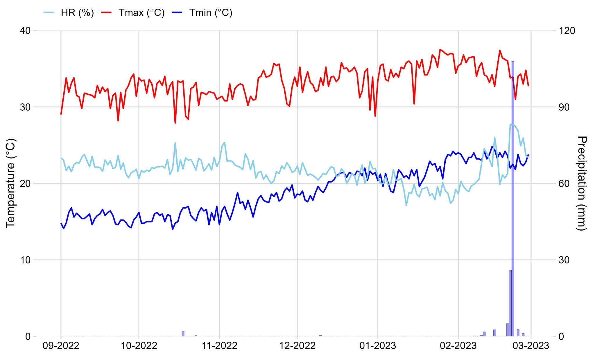
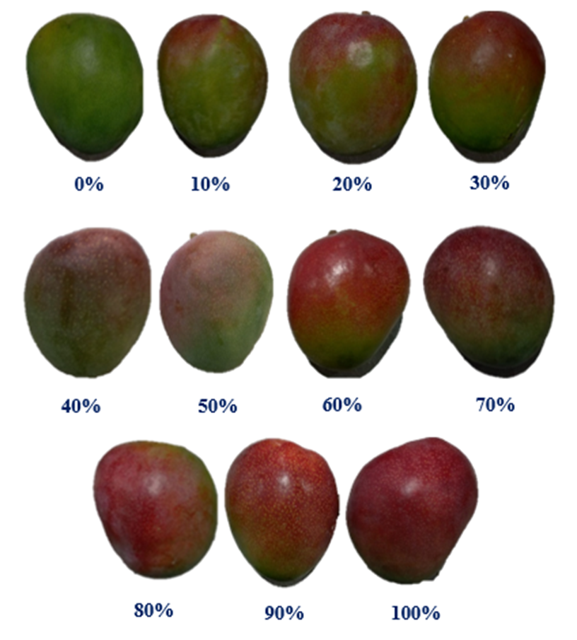
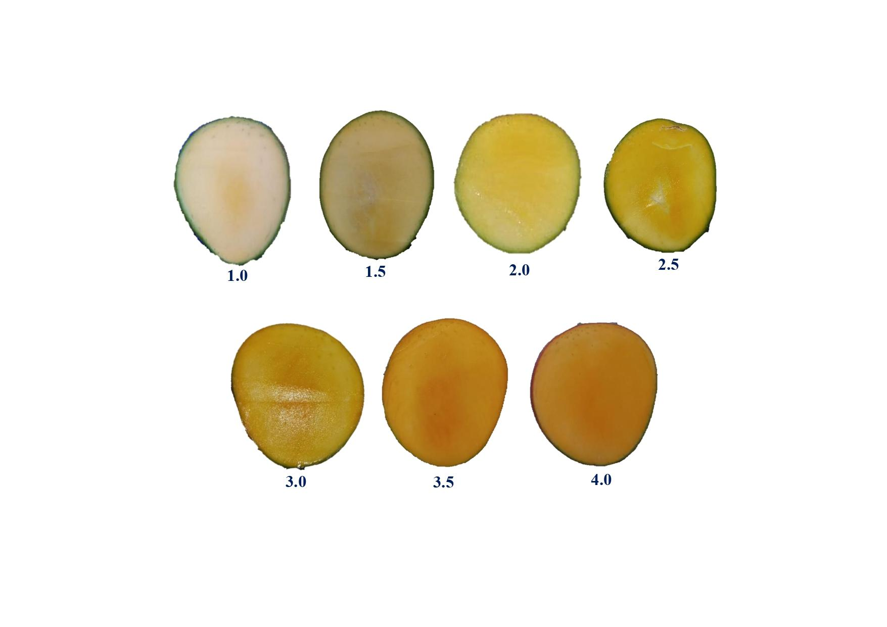
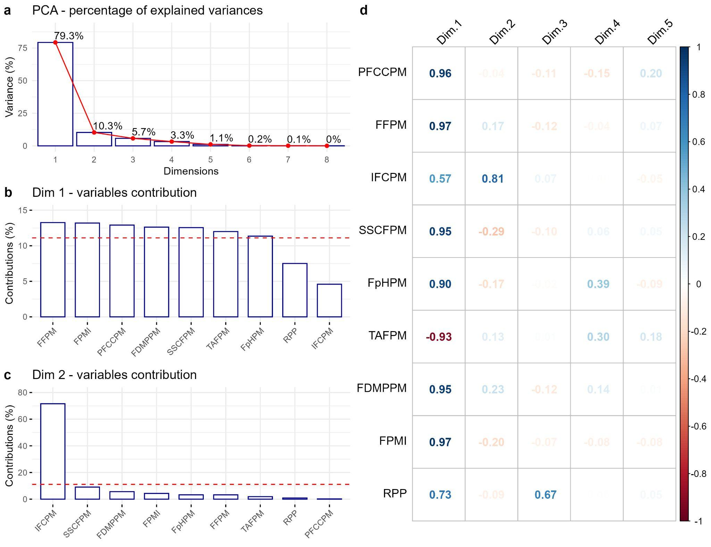
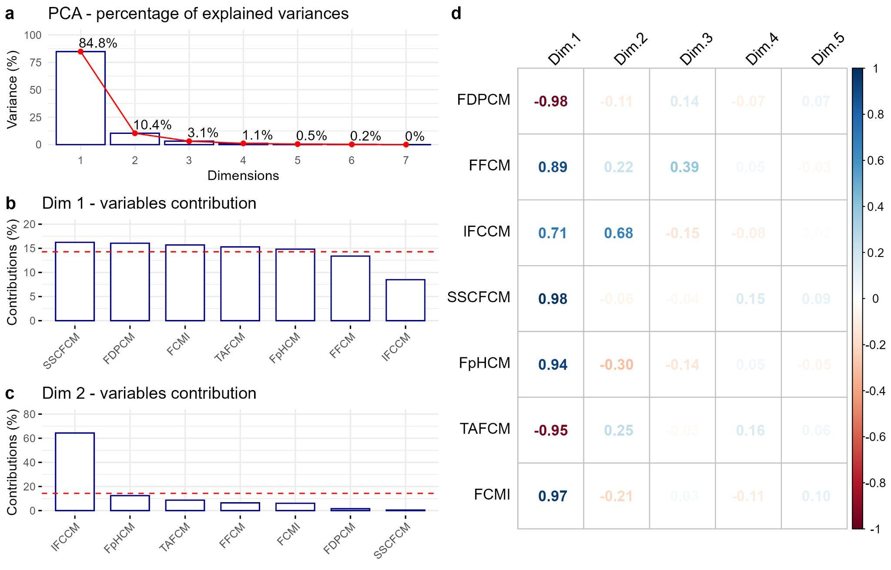
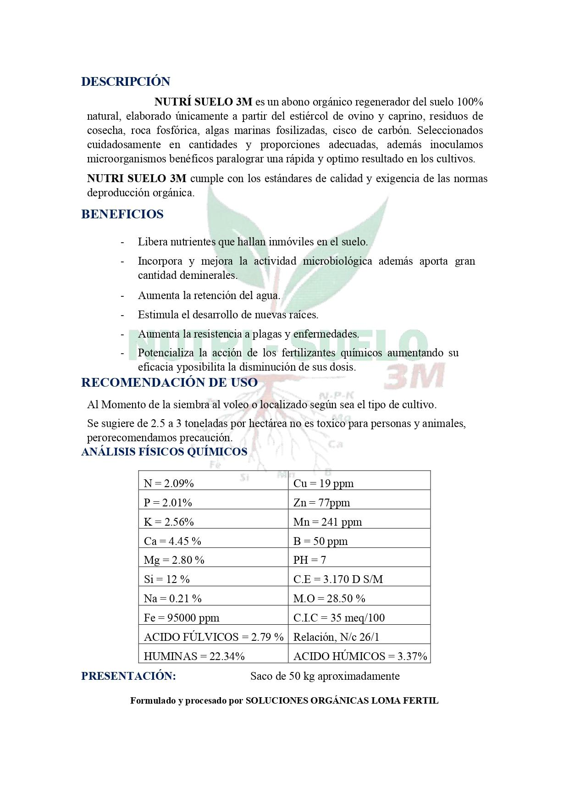

**Impact of organic fertilizers on quality and post-harvest management of Mango ‘Kent’ (*Mangifera indica* L.)**

Henry Morocho-Romero^1,2†^; Ricardo Peña-Castillo^2†^; Arturo Morales-Pizarro^2†.^ Junior Domínguez-Chozo^2^; Sandy Vilchez-Navarro^1,2^, Sebastian Casas-Niño^1^; Gabriela Cárdenas-Huamán^1^; Nery Tirabante-Terrones^1^; Esdwin-Oberti Nuñez-Ticliahuanca^1^; Ana Montañez-Artica^1^; Leslie Velarde-Apaza^1^; Max Ramirez-Rojas^1^; Juancarlos Cruz^1^; Flavio Lozano-Isla^1,3#^.

***​^1^ **Dirección de Supervisión y Monitoreo en las Estaciones Experimentales Agrarias, Instituto Nacional de Innovación Agraria. Lima. Perú.*

*^2^ Universidad Nacional de Piura, Campus Universitario s/n. Urb. Miraflores. Piura, Perú.*

*^3^ Facultad de Ingeniería y Ciencias Agrarias, Universidad Nacional Toribio Rodríguez de Mendoza de Amazonas (UNTRM), Chachapoyas, Peru*

* ^†^ Equal contributing author.*

* ^#^ *Corresponding author: [flavio.lozano@untrm.edu.pe](mailto:flavio.lozano@untrm.edu.pe) 


ORCID IDs:

Henry Morocho-Romero: [0000-0002-1520-2372](https://orcid.org/0000-0002-1520-2372)

Ricardo Peña-Castillo:[0000-0001-9366-4962](https://orcid.org/0000-0001-9366-4962)

Arturo Morales-Pizarro: [0000-0003-3966-6689](https://orcid.org/0000-0003-3966-6689)

Junior Dominguez-Chozo: [0009-0008-4510-5267](https://orcid.org/0009-0008-4510-5267)

Sandy Vilchez-Navarro: [0009-0002-1784-5563](https://orcid.org/0009-0002-1784-5563)

Sebastian Casas-Niño: [0000-0002-6576-8761](https://orcid.org/0000-0002-6576-8761)

Gabriela Cárdenas-Huamán: 0000-0002-8379-5464

Nery Tirabante-Terrones: [0000-0002-0634-1522](https://orcid.org/0000-0002-0634-1522)

Edwin-Oberti Nuñez-Ticliahuanca: [0009-0004-4613-0625](https://orcid.org/0009-0004-4613-0625)

Ana Montañez-Artica: [0000-0003-3580-6621](https://orcid.org/0000-0003-3580-6621)

Leslie Velarde-Apaza: 0000-0001-6031-6355

Max Ramirez-Rojas: [0000-0003-3322-0838 ](https://orcid.org/0000-0003-3322-0838)

Juancarlos Cruz: [0009-0005-8288-2768](https://orcid.org/0009-0005-8288-2768)

Flavio Lozano-Isla: [0000-0002-0714-669X](https://orcid.org/0000-0002-0714-669X)


# 

# DECLARACIONES

**Agradecimientos**

The authors want to thank Mr. L. Córdova C. for his support in fieldwork and technical management of the crop. To Eng. C.P. Roque V. for his contribution to the post-harvest management of mango

**Financiación**

This work was funded by the company 'Soluciones Orgánicas Loma Fértil,' Piura-Peru, and the National Institute of Agricultural Innovation (INIA), Peru through the investment project N°. 2472190 'El Chira'.

**Conflicto de intereses**

# **The authors declare no conflict of interest.**

**Contribuciones de los autores**

Conceptualization, H.M-R., R.P-C. and A.M-P.; methodology, A.M-P. and J.D-C.; formal analysis, F.L-I. and S.C-N.; investigation, H.M-R.; resources H.M-R.; data curation, F.L-I. and S.C-N.; writing—original draft preparation, H.M-R., S.V-N., G.C-H., N.T-T., E-O.N-T., A-G.A-M., F.L-I. and S.C-N.; writing—review and editing, F.L-I. and L.V-A.; visualization, F.L-I. and S.C-N.; supervision, J.C. and M.R-R.; funding acquisition, J.C. All authors have read and agreed to the published version of the manuscript.

**Investigación Reproducible**

**The original contributions presented in this study are included in the article and supplementary material. The reproducible data analysis and datasets are available in Supplementary File 2 and can be accessed through the GitHub repository at [https://github.com/Sebass96/prochira\_abonos\_mango](https://github.com/Sebass96/prochira_abonos_mango)** 

# ABSTRACT

Mango (*Mangifera indica* L.) is a fruit tree with high global demand. Its fruit presents morphological, physiological, and biochemical changes during maturation. Adequate nutrient supply during the different physiological stages is key to increasing fruit yield and quality. This research was conducted in the Piura region of Peru, evaluating eight-year-old mango trees of the 'Kent' variety, planted at a distance of 7 x 7 m during the 2022–2023 season. A 3 x 3 factorial design with three replications was employed, where the first factor was the application of compost at 0, 5, and 15 t/ha, and the second factor was the application of biol at concentrations of 0%, 5%, and 10%. The results showed that the combined organic fertilization with compost and biol positively affected fruit yield and quality, as it improved fruit firmness, increased soluble solids and dry matter content, and decreased titratable acidity and fruit dehydration during physiological and commercial maturity stages. These results suggest that applying organic fertilizers significantly enhances the quality of mango fruits.

**Keywords:** crop productivity, nutrient management, sustainable farming, agricultural practices, fruit quality

# 

# INTRODUCTION

The mango (*Mangifera indica* L.) is a tropical fruit tree whose origins date back to 4000 B.C. in South Asia [[1,2]](https://www.zotero.org/google-docs/?0c8sC5). Worldwide, the production of mangoes (M. *indica* L.), guavas (*Psidium guajava*), and mangosteens (*Garcinia mangostana* L.) amounts to 59.15 million metric tons (Mt), with India producing 15.64 Mt, China 3.02 Mt, Indonesia 2.09 Mt, and Thailand 2.07 Mt as the leading producers. In the American continent, production reaches 4.80 Mt, with Mexico and Brazil being the leading producers, contributing 1.78 Mt and 1.21 Mt, respectively [[3]](https://www.zotero.org/google-docs/?SkrMOj). The high demand for mango globally is attributed to its sensory characteristics and health benefits, making it a tropical treasure among seasonal fruits [[1,4,5]](https://www.zotero.org/google-docs/?QhzXPD).

The mango fruit is a fleshy drupe that undergoes morphological, physiological, and biochemical changes during its physiological and commercial ripening process, which enhances its sensory and organoleptic qualities [[6–8]](https://www.zotero.org/google-docs/?p0uVcK). Physiological maturity is characterized by reaching the maximum fruit size, seed vigor, and reserve substances, serving as an intermediate stage before the senescence period [[9,10]](https://www.zotero.org/google-docs/?as2WHJ). On the other hand, commercial maturity is determined by a decrease in chlorophyll, an increase in carotenoids, softening of the cell wall, degradation of polysaccharides, and modification of organic acids, which enhance the sensory perception and flavor of the fruit [[9,11–13]](https://www.zotero.org/google-docs/?cUtqZl).

Proper nutrient supply during phenological stages of growth and development ensures optimal fruit yield. However, fruit quality and postharvest management involve addressing aesthetic, physical, chemical, and biological characteristics, as well as health benefits and environmental impacts associated with production [[14–16]](https://www.zotero.org/google-docs/?ifejwC).

Mango fertilization is linked to applying synthetic NPK fertilizers to achieve high yields [[17]](https://www.zotero.org/google-docs/?sRBv0j). However, synthetic fertilizers and pesticides have caused environmental pollution, decreased soil health, and impacted food security [[18–20]](https://www.zotero.org/google-docs/?Qp1C10). An alternative to mitigate the use of synthetic fertilizers is organic farming, which employs organic composts to achieve native soil fertilization, high-yield crops, quality fruits, and reduced environmental pollutants [[21,22]](https://www.zotero.org/google-docs/?0J6IXO). 

The mango plant requires sources of nitrogen, phosphorus, and potassium to achieve optimal vegetative growth, reproductive development, and yield [[23,24]](https://www.zotero.org/google-docs/?KkZY7p). Organic fertilizers are characterized by having lower concentrations of nutrients but a greater number of nutrients, thanks to the fact that they intervene in the synthesis of compounds [[25]](https://www.zotero.org/google-docs/?Zr2hW7). They can be applied as soil amendments or foliar treatments as they are slow-releasing and improve the yield and quality of mango fruit from trees [[26]](https://www.zotero.org/google-docs/?nZnMcR). Soil amendments improve the soil-plant system by increasing root hair density, promoting soil biota, preventing pathogens, and ensuring gradual mineralization of nutrients [[27–29]](https://www.zotero.org/google-docs/?wx9MyZ). As for foliar fertilizers, they stimulate morphological and physiological changes in the plant due to micronutrients, phytohormones, and aromatic substances, which elongate cell tissues and provide repellent action against pests and diseases [[30–32]](https://www.zotero.org/google-docs/?eMg0q1). 

The objective of the present study is to evaluate the effect of organic fertilizers, specifically compost, and biol applied at the soil and foliar levels on the quality of mango fruit at physiological and commercial maturity. The study was conducted at  Tambogrande district in Peru during the 2022-2023 production season. 

# 

# MATERIALS AND METHODS

## Study area and plant material

The research area was located in the village of Las Mónicas, Tambogrande district, Piura region, with a latitude of 4° 54' 45'' S, longitude of 80° 16' 9'' W, and an elevation of 96 m.a.s.l ([Figure  @fig:id.umhwcapm7kiw]:). The climate was characterized by minimum temperatures of 14°C and maximum temperatures of 37.5°C and a monthly accumulated precipitation ranged from 0 mm to 147.7 mm ([Figure  @fig:id.qcsp3ox8lybb]:).

The physical and chemical properties of the soil presented a texture with 68% sand, 16% silt, and 16% clay; pH of 7.51; organic matter at 0.96%; electrical conductivity of 0.18 dS/m; nitrogen at 480 mg/kg; phosphorus at 25.9 mg/kg; potassium at 268 mg/kg; and cation exchange capacity at 10.88 cmol/kg. 

The plant material consisted of eight-year-old ‘Kent’ mango trees, planted in a 7 x 7 meter spacing. The study was conducted from September 2022 to February 2023.

{#fig:id.umhwcapm7kiw}

The ‘Kent’ variety was developed in 1932 in Florida, USA, from seeds of the ‘Brooks’ variety. However, it was not until 1938 that the first fruits were produced, and the variety was officially described in 1945 (31). In Peru, the ‘Kent’ variety of mango predominates over other varieties due to its slightly oval shape, dark green color with reddish hues at the base, prominent lenticels around the thin skin, juicy flesh with low fiber, and sweet, buttery flavor. These characteristics have led to increased exports and expansion into new international markets such as South Korea, Belgium, and Germany(32)**.** 

## Organic fertilizers

Organic fertilizers include compost as the commercial product Compost Nutri Suelo 3M. It was produced by Soluciones Orgánicas Loma Fertil® in Las Monicas-CP7, Piura, Peru. The formulation presents native efficient microorganisms isolated from the Tambogrande. The bio was prepared artisanally following the methodology proposed by Chanduví-García et al () with modifications.  A 200-liter capacity cylinder was used, into which a 25 kg sack of Compost Nutri Suelo 3M was introduced. In a 60-liter pot of water, 12 kg of leaves from native plants such as Altamisa (*Ambrosia peruviana*), Higuerilla (*Ricinus communis*), and Neem (*Azadirachta indica*), cut into 2 x 2 cm squares, was introduced, along with 4 kg of garlic (*Allium sativum*), 4 kg of onion (*Allium cepa*), 3 kg of chili (*Capsicum annuum*), and 20 liters of water. These ingredients were boiled for 8 hours, during which 30 liters of water were added. Subsequently, the boiled ingredients were placed into the 200-liter cylinder. To this, 5 liters of fermented maize beverage "chicha de jora", 4 kg of cane molasses, and 4 liters of efficient microorganisms were added, and the cylinder was filled with water to reach its full capacity. The container was then sealed tightly and left for 20 days. 

The physicochemical analysis and nutritional composition of Compost Nutri Suelo 3M and homemade biol were conducted at the Water, Soil, Plants, and Fertilizers Laboratory of the Faculty of Agronomy at the National Agrarian University La Molina, Lima, Peru (Table 1).

```Unknown element type at this position: UNSUPPORTED```


| Table 1: Chemical analysis and nutritional composition of organic fertilizers, Compost Nutri Suelo 3M, and biol used to evaluate the quality and postharvest characteristics of mango (*Mangifera indica* L.) var. ‘Kent’ in Tambogrande, Piura.  |


| **Organic fertilizers** | **N (ppm)**             | **P (ppm)**             | **K (ppm)**             | **Ca (ppm)**            | **Mg (ppm)**            | **Na (ppm)**            | **M.O****%**            | **pH**                  | **CE****d/Sm**           |
|-------------------------|-------------------------|-------------------------|-------------------------|-------------------------|-------------------------|-------------------------|-------------------------|-------------------------|--------------------------|
| Compost                 | 20900                   | 20100                   | 25600                   | 44500                   | 28000                   | 2100                    | 28.5                    | 7                       | 31.7                     |
| Biol (p/v)              | 1143.2                  | 181.4                   | 1975                    | 440                     | 145                     | 248                     | 2.14                    | 3.1                     | 10.54                    |


## 

## Organic fertilization treatments

The organic fertilization treatments used in this study included a control with conventional application (0-0) commonly used by farmers: 150 kg/ha of N, 80 kg/ha of P₂O₅, 200 kg/ha of K₂O, 25 kg/ha of MgO, and 40 kg/ha of Ca. Compost was incorporated at different rates, 5 t/ha (5-0) and 15 t/ha (15-0). Biol was applied at two concentrations, 5% (0-5) and 10% (0-10), as well as combinations of compost and biol. These combinations included compost at 5 t/ha with 5% biol (5-5), compost at 5 t/ha with 10% biol (5-10), compost at 15 t/ha with 5% biol (15-5), and compost at 15 t/ha with 10% biol (15-10).

The fertilization application was carried out in a single instance during the fruit formation stage, corresponding to the second fruit drop category BBCH: 73 [[33]](https://www.zotero.org/google-docs/?vNqG2N). This involved incorporating the compost into the arable layer around the projected canopy of the tree. In contrast, the biol applications were performed foliar at three intervals: the first coinciding with the compost application, the second fifteen days after the first application, and the third twenty days after the second application.

## **Study Variables**

The variables were evaluated during the 2022-2023 growing season. The analysis focused on mango fruits of the ‘Kent’ variety at two stages, physiological maturity BBCH: 87 and commercial maturity BBCH: 88.

The traits included yield by plant (YP) and fruit quality variables for physiological maturity. At harvest, five fruits per mango tree were collected, with the fruits being marked before the application of treatments. The percentage of fruit canopy cover at physiological maturity (PFCCPM, %) was analyzed using an image chart that provides percentage values of carotenoids present in the mango skin (Supplementary Figure 1). Fruit firmness at physiological maturity (FFPM, kg/cm²) was evaluated according to the NMX-FF-014 [[34]](https://www.zotero.org/google-docs/?dYnqfE) methodology. The internal fruit color at physiological maturity (IFCPM) was analyzed using an image chart elaborated in our study with representative color codes (Supplementary Figure 2). Soluble solids content of the fruit at physiological maturity (SSCFPM, ºBrix), fruit pH at physiological maturity (FpHPM), titratable acidity of the fruit at physiological maturity (TAFPM, %), and fruit dry matter percentage at physiological maturity (FDMPPM, %) were analyzed using methods 932.12, 981.12, 942.15, and 963.15 as described in the Official Methods of Analysis 2005 [[35]](https://www.zotero.org/google-docs/?qh4EcI). The fruit physiological maturity index (FPMI) was calculated by dividing SSCFPM by TAFPM.

Fifteen mango fruits were sampled from each treatment for the analysis of traits at commercial maturity. The fruits were selected at physiological maturity during harvest and subjected to a commercial ripening process according to the method of Zamora-Cienfuegos et al [[36]](https://www.zotero.org/google-docs/?WDYDBk) with minor modifications. The process involves treating the mango fruits without refrigeration and ethylene doses. Initially, the mangoes are stored in a refrigerator at 13±1 ºC for 2 days. Subsequently, the fruits are transferred to a closed room for 12 hours, where the ambient temperature rises to above 26±2 ºC. After this period, the room is opened. The carbon dioxide (CO₂) released by the fruits was expelled using a fan for 12 hours. This procedure was repeated for five days, during which the mango fruits reached commercial maturity. The fruit dehydration percentage at commercial maturity  (FDPCM, %) was determined by comparing the weights before and after the commercial ripening process. The fruit firmness at commercial maturity (FFCM, kg/cm²) was evaluated using the NMX-FF-014 [[34]](https://www.zotero.org/google-docs/?iIsm7J) methodology. The internal fruit color at commercial maturity (IFCCM) was analyzed using a color-coded image chart (Supplementary Figure 2). Soluble solids content of the fruit at commercial maturity (SSCFCM, °Brix), fruit pH at commercial maturity (FpHCM), and titratable acidity of the fruit at commercial maturity  (TAFCM, %) were measured using methods 932.12, 981.12, and 942.15 from Official Methods of Analysis 2005 [[35]](https://www.zotero.org/google-docs/?FM4M7l). The commercial maturity index of the fruit (FCMI) was calculated by dividing SSCFCM by the percentage of TAFCM.

## Statistical Analysis

The experiment was carried out using a 3 x 3 factorial design with three replications. The first factor was the application of compost at levels of 0, 5, and 15 t/ha, and the second factor was the application of biol at concentrations of 0%, 5%, and 10%. The experimental unit consisted of five mango trees. Three plants were randomly selected for the evaluations YP, PFCCPM, FFCM, IFCPM, SSCFCM, FpHPM, TAFPM, FDMPPM, FPMI, FDPCM, FFCM, IFCCM, SSCFCM, FpHCM, TAFCM, and FCMI. Five fruits per plant were evaluated for analysis at physiological maturity. Fifteen fruits per treatment were selected for analysis of fruits at commercial maturity. An analysis of variance (ANOVA) was conducted to determine if there were differences among the treatment applications. The mean comparison test used was Tukey's test implemented in the R package *emmeans* (Searle et al., 1980). The 16 variables under study were subjected to multivariate analysis of principal components (PCA) using the *FactoMineR* package. The correlation analysis of variables in PCA was conducted using the corrplot package. The data analysis was performed using R statistical software version 4.4.1 (R Core Team, 2024, Supplementary File 2).

# RESULTS

## Wheater conditions

To determine the behavior of meteorological conditions in mango cultivation during its physiological and commercial maturity, the following variables were used: temperature, precipitation, and relative humidity ([Figure  @fig:id.qcsp3ox8lybb]:). These variables determine the presence of pests, diseases, and physiological deficiencies that affect fruit production and quality.

Tthe lowest values for temperature were recorded from September to December 2022, reaching 14.0 °C in October. Meanwhile, the highest temperature values were observed in January and February 2023, reaching 37.5 °C in January. For precipitation, the highest values were recorded in February 2023, with an accumulation of 147.7 mm, which coincided with the highest relative humidity percentage of 67.91%. On the other hand, the lowest relative humidity value of 57.94% was recorded in January, coinciding with the highest temperature. The temperatures recorded during January and February favored fruit ripening. 

Temperatures exceeding 30 °C over consecutive days reduce fruit growth. The cessation of fruit growth accelerates respiration processes, transpiration, and enzymatic reactions. Similarly, lower relative humidity values reduced the presence of fungal diseases such as anthracnose and botrytis.

{#fig:id.qcsp3ox8lybb}

## **Fruit quality traits at physiological maturity**

To evaluate the quality characteristics of the fruit at physiological maturity ([Figure  @fig:kix.jeoh8ws8urib]:), a univariate analysis was conducted at physiological maturity on fruit firmness (FFPM), soluble solids content of the fruit (SSCFPM), titratable acidity of the fruit (TAFPM), and fruit dry matter percentage (FDMPPM). These variables are crucial to determining the physiological maturity of the fruit at harvest and in preventing damage from handling during commercialization or industrial processes.


{#fig:kix.jeoh8ws8urib}

Regarding FFPM, no significant differences were observed between the interaction of compost and biol applications (p-value = 0.68, [Figure  @fig:kix.jeoh8ws8urib]:a). However, differences were noted in the various doses of compost and biol used. In terms of the application of biol, significant differences were observed across the different doses used at the three compost levels. The 10% biol dose showed the highest firmness values, with an average of 12.46 kg/cm^2^. In the compost application, it was observed that the 15 t/ha dose resulted in slightly higher firmness with an average of 12.41 kg/cm^2^. Despite the lack of interaction between compost and biol, the application of 15 t/ha + 10% biol achieved the highest fruit firmness value at 12.96 kg/cm^2^. This value represents a 13.8% increase in firmness compared to the control with a firmness of 11.38 kg/cm^2^. 

The SSCFPM showed significant differences for the interaction between compost and biol (p-value = 0.01, [Figure 3](https://docs.google.com/document/d/1ySwDDV4CYy3IYeRz8Fg_sUGJ30KOWt2aGAcdRm7EHFU/edit?pli=1#bookmark=kix.jeoh8ws8urib)b). The highest average soluble solids values were achieved with the applications of 15 t/ha compost + 5% biol and 5 t/ha compost + 10% biol, both reaching 9.29 ºBrix. In contrast, the lowest average soluble solids content was observed with the conventional fertilization treatment (0 t/ha compost + 0% biol), which recorded 8.57 ºBrix. These values represent an 8.4% increase compared to the soluble solids content obtained with the combined application of organic fertilizers at a dose of 15 t/ha compost + 5% biol, compared to the absence of these applications. 

Significant differences were found for TAFPM between the compost and biol interactions (p-value = 0.01, [Figure 3](https://docs.google.com/document/d/1ySwDDV4CYy3IYeRz8Fg_sUGJ30KOWt2aGAcdRm7EHFU/edit?pli=1#bookmark=kix.jeoh8ws8urib)c). It was observed that the combined application of organic fertilizers resulted in the lowest average acidity levels, with the dose of 15 t/ha compost + 10% biol achieving 1.23%. In contrast, the highest acidity values were observed with conventional fertilization (compost 0 t/ha + biol 0%), at 1.36%. It is noteworthy that applying biol at 10% either individually or in combination with compost resulted in lower acidity values, reaching up to a maximum of 1.27%.

The FDMPPM did not show significant differences between the interactions of compost and biol application (p-value = 0.61, [Figure 3](https://docs.google.com/document/d/1ySwDDV4CYy3IYeRz8Fg_sUGJ30KOWt2aGAcdRm7EHFU/edit?pli=1#bookmark=kix.jeoh8ws8urib)d). However, the highest mean was obtained with the application of compost 15 t/ha + biol 10%, at 20.96%. In contrast, the lowest percentage was observed with the conventional fertilization treatment (compost 0 t/ha + biol 0%), at 19.26%, representing an 8% increase in dry matter. It is important to note that fruits treated with biol at 10% either individually or combined with compost exceeded 20.0% dry matter.

To analyze the interaction of the variables and organic fertilizer doses at physiological maturity, a principal component analysis (PCA) and a Pearson correlation analysis were conducted with the PCA variable ([Figure  @fig:id.lorxrx2m0tsw]:, Supplementary Figure 3).

```Unknown element type at this position: UNSUPPORTED```

![Principal Component Analysis (PCA) of quality traits for mango fruits at physiological maturity from compost and biol applications. (a) Physicochemical variables evaluated at physiological maturity for mango fruits. (b) Treatments based on compost and biol used for evaluating agronomic traits. Where: yield per plant (YP), percentage of fruit canopy cover at physiological maturity (PFCCPM), fruit firmness at physiological maturity (FFPM), internal fruit color at physiological maturity (IFCPM), soluble solids content of the fruit at physiological maturity (SSCFPM), fruit pH at physiological maturity (FpHPM), titratable acidity of the fruit at physiological maturity (TAFPM), fruit dry matter percentage at physiological maturity (FDMPPM), fruit physiological maturity index (FPMI). The analysis was based on 405 samples (n = 405).](img_3.jpg){#fig:id.lorxrx2m0tsw}


```Unknown element type at this position: UNSUPPORTED```To evaluate the interaction of the traits a multivariate Principal Component Analysis (PCA) was used [Figure 4](https://docs.google.com/document/d/1ySwDDV4CYy3IYeRz8Fg_sUGJ30KOWt2aGAcdRm7EHFU/edit?pli=1#bookmark=id.lorxrx2m0tsw)). The first two components represent 79.29% at dimension 1 and 10.27% at dimension 2 resulting in a cumulative variance of 89.56% ([Figure 4](https://docs.google.com/document/d/1ySwDDV4CYy3IYeRz8Fg_sUGJ30KOWt2aGAcdRm7EHFU/edit?pli=1#bookmark=id.lorxrx2m0tsw)a, Supplementary Figure 3a). For dimension 1, the variables FFPM, FPMI, and FDMPPM contributed the most to this dimension with 13.27%, 13.20%, and 12.62%, respectively, compared to IFCPM at 4.59% and YP at 7.51% contribution ([Figure 4](https://docs.google.com/document/d/1ySwDDV4CYy3IYeRz8Fg_sUGJ30KOWt2aGAcdRm7EHFU/edit?pli=1#bookmark=id.lorxrx2m0tsw)a, Supplementary Figure 3b). In dimension 2, IFCPM had the highest contribution at 71.60%, while PFCCPM and YPP had the lowest contributions at 0.18% and 0.88%, respectively ([Figure 4](https://docs.google.com/document/d/1ySwDDV4CYy3IYeRz8Fg_sUGJ30KOWt2aGAcdRm7EHFU/edit?pli=1#bookmark=id.lorxrx2m0tsw)a, Supplementary Figure 3c). The variables FFPM, FDMPPM, SSCFPM, and TAFPM presented the highest contribution in the analysis due to their significance in determining the physiological maturity of the fruit at the time of harvest.

The PCA of the variables illustrates the relationship between the traits. A positive relationship among FFPM, FDMPPM, SSCFPM, TAFPM, IFCPM, FpHPM, FPMI, PFCCPM, and YP was found. In contrast to TAFPM which shows a negative relationship. There is a strong positive correlation (0.97) between FFPM and a strong negative correlation (-0.93) between TAFPM with respect to dimension 1. For Dimension 2, the variable IFCPM shows a strong positive correlation of 0.81 ([Figure 4](https://docs.google.com/document/d/1ySwDDV4CYy3IYeRz8Fg_sUGJ30KOWt2aGAcdRm7EHFU/edit?pli=1#bookmark=id.lorxrx2m0tsw)a, Supplementary Figure 3d).

On the other hand, it is observed that the conventional fertilization (compost 0 t/ha + biol 0%) aligns with the direction of the TAFPM vector, indicating that individuals receiving this treatment had higher values of fruit titratable acidity. In the case of IFCPM, the dose of compost 15 t/ha + biol 10% showed the highest values. Similarly, for the variables FFPM and FDMPPM, the application of compost 15 t/ha + biol 10% yielded the highest values. For the variables, SSCFPM, FPMI, and FpHPM, the doses of compost 15 t/ha + biol 5% and compost 5 t/ha + biol 10% showed the best results ([Figure 4](https://docs.google.com/document/d/1ySwDDV4CYy3IYeRz8Fg_sUGJ30KOWt2aGAcdRm7EHFU/edit?pli=1#bookmark=id.lorxrx2m0tsw)b). 

## Characteristics of mango fruit quality at commercial maturity

To evaluate the quality characteristics of the fruit at commercial maturity a univariate analysis was conducted on fruit firmness (FFCM), soluble solids content of the fruit  (SSCFCM), titratable acidity of the fruit (TAFCM), and fruit dehydration percentage (FDPCM). These variables are important for determining the commercial maturity of the fruit in the post-harvest handling process.

{#fig:id.apkbyaf8rnn2}

Significant differences were observed for FFCM between the interactions of compost and biol application (p-value = 0.03). The highest mean value for fruit firmness was obtained with the application of compost at 15 t/ha + biol 10% with 4.33 kg/cm^2^. In contrast, the lowest mean value for soluble solids was observed with the application of compost 0 t/ha + biol 5% with 3.44 kg/cm^2^. This demonstrates a 25.87% increase in fruit firmness ([Figure 5](https://docs.google.com/document/d/1ySwDDV4CYy3IYeRz8Fg_sUGJ30KOWt2aGAcdRm7EHFU/edit?pli=1#bookmark=id.apkbyaf8rnn2)a).

The SSCFCM did not show significant differences between the interactions of compost and biol (p-value = 0.91, [Figure 5](https://docs.google.com/document/d/1ySwDDV4CYy3IYeRz8Fg_sUGJ30KOWt2aGAcdRm7EHFU/edit?pli=1#bookmark=id.apkbyaf8rnn2)b). However, differences were observed among the various doses of compost and biol used. The highest mean values of soluble solids were obtained with the application of compost 15 t/ha + biol 10% with 16.12 ºBrix. In contrast, the lowest mean of soluble solids was observed with the application of compost 5 t/ha + biol 0%, at 14.84 ºBrix. These values represent an increase of 8.6% in the soluble solids present in the fruit. 

For TAFCM, significant differences were found between the interaction of compost and biol (p-value < 0.001, [Figure 5](https://docs.google.com/document/d/1ySwDDV4CYy3IYeRz8Fg_sUGJ30KOWt2aGAcdRm7EHFU/edit?pli=1#bookmark=id.apkbyaf8rnn2)c). It was observed that with the combined application of organic fertilizers, the lowest mean acidity was achieved with the dose of compost 15 t/ha + biol 10% with 0.47%. In contrast, the highest acidity values were observed with conventional fertilization (compost 0 t/ha + biol 0%) with 0.62%. It is noteworthy that applying compost at 15 t/ha, either alone or in combination with biol, resulted in lower acidity values with values below 0.51%.

For FDPCM, no significant differences were found in the interaction between compost and biol applications (p-value = 0.40, [Figure 5](https://docs.google.com/document/d/1ySwDDV4CYy3IYeRz8Fg_sUGJ30KOWt2aGAcdRm7EHFU/edit?pli=1#bookmark=id.apkbyaf8rnn2)d). However, differences were observed among the various doses of compost and biol used. Regarding the application of biol, significant differences were observed within the compost doses of 0 t/ha and 10 t/ha. The doses with no biol application (0%) exhibited the highest fruit dehydration, with an average of 6.58%. In the compost application, it was also observed that the 0 t/ha dose resulted in a higher percentage of dehydration, with a mean value of 6.57%. Despite the lack of interaction between compost and biol, the application of compost 15 t/ha + biol 10% resulted in the lowest dehydration value at 6.16%. This represents an 8.9% decrease in fruit dehydration compared to the 6.76% observed with conventional fertilization (compost 0 t/ha + biol 0%). 

To analyze the interaction of the traits and treatments of doses of organic fertilizers a principal component analysis (PCA) and Pearson correlation analysis were conducted in the PCA variables ([Figure  @fig:id.awvbghja6kxt]:, Supplementary Figure 4).

```Unknown element type at this position: UNSUPPORTED```

![Principal Component Analysis (PCA) of physicochemical variables of mango fruits at commercial maturity with compost and biol applications. (a) Physicochemical traits of fruits at commercial maturity. (b) Compost and biol-based treatments used for the evaluation of agronomic traits. Where: fruit dehydration percentage at commercial maturity (FDPCM, %), fruit firmness at commercial maturity (FFCM, kg/cm^2^), internal fruit color at commercial maturity (IFCCM), soluble solids content of the fruit at commercial maturity (SSCFCM, °Brix), fruit pH at commercial maturity (FpHCM), titratable acidity of the fruit at commercial maturity (TAFCM, %), and fruit commercial maturity index (FCMI). Analysis based on 135 samples (n = 135).](img_5.jpg){#fig:id.awvbghja6kxt}


```Unknown element type at this position: UNSUPPORTED```To evaluate the interaction of the variables at commercial maturity a multivariate principal component analysis (PCA) method was used ([Figure 6](https://docs.google.com/document/d/1ySwDDV4CYy3IYeRz8Fg_sUGJ30KOWt2aGAcdRm7EHFU/edit?pli=1#bookmark=id.awvbghja6kxt)). The first two components represent 84.79% at dimension 1 and 10.35% at dimension 2 of the variance representing a cumulative variance of 95.14% ([Figure 6](https://docs.google.com/document/d/1ySwDDV4CYy3IYeRz8Fg_sUGJ30KOWt2aGAcdRm7EHFU/edit?pli=1#bookmark=id.awvbghja6kxt)a, Supplementary Figure 4a). For dimension 1, the variables FDPCM and SSCFCM contributed the most to this dimension with 16.06% and 16.24%, respectively, compared to IFCCM with an 8.50% contribution ([Figure 6](https://docs.google.com/document/d/1ySwDDV4CYy3IYeRz8Fg_sUGJ30KOWt2aGAcdRm7EHFU/edit?pli=1#bookmark=id.awvbghja6kxt)a, Supplementary Figure 4b). In dimension 2, the IFCCM had the highest contribution at 64.34%, while the FDPCM and fruit SSCFCM had the lowest contributions at 1.57% and 0.49%, respectively ([Figure 6](https://docs.google.com/document/d/1ySwDDV4CYy3IYeRz8Fg_sUGJ30KOWt2aGAcdRm7EHFU/edit?pli=1#bookmark=id.awvbghja6kxt)a, Supplementary Figure 4c). It is important to note that the variables FDPCM, SSCFCM, IFCCM, TAFCM, FpHCM, and FFCM presented high contributions in the analysis due to their importance in determining the commercial maturity of the fruit for sale.

The PCA of the variables shows the relationship between the variables, with a positive correlation among the variables SSCFCM, IFCCM, FpHCM, and FFCM, in contrast with fruit FDPCM and TAFCM, which show a negative correlation ([Figure 6](https://docs.google.com/document/d/1ySwDDV4CYy3IYeRz8Fg_sUGJ30KOWt2aGAcdRm7EHFU/edit?pli=1#bookmark=id.awvbghja6kxt)a, Supplementary 4d). At this point, it is notable that the variable SSCFCM shows a strong positive correlation of 0.98, while the variable FDPCM exhibits a strong negative correlation of -0.98 for dimension 1. Additionally, for dimension 2, the variable IFCCM demonstrates a moderate positive correlation of 0.68 ([Figure 6](https://docs.google.com/document/d/1ySwDDV4CYy3IYeRz8Fg_sUGJ30KOWt2aGAcdRm7EHFU/edit?pli=1#bookmark=id.awvbghja6kxt)a, Supplementary 4d).

It is observed that conventional fertilization (compost 0 t/ha + biol 0%) and the dose of compost 0 t/ha + biol 5% are aligned with the vectors for FDPCM and titratable TAFCM. Therefore, the individuals subjected to these treatments exhibited higher values for these variables  ([Figure 6](https://docs.google.com/document/d/1ySwDDV4CYy3IYeRz8Fg_sUGJ30KOWt2aGAcdRm7EHFU/edit?pli=1#bookmark=id.awvbghja6kxt)). In the case of IFCCM, the conventional fertilization dose (compost 0 t/ha + biol 0%) also showed the lowest values. Similarly, for the variables FFCM and SSCFCM, the application of compost at 15 t/ha + biol 10% and compost at 15 t/ha + biol 5% resulted in the highest values. Regarding the IFCCM and FpHCM, the compost dose of 15 t/ha + biol 10% showed the hights values for these variables ([Figure 6](https://docs.google.com/document/d/1ySwDDV4CYy3IYeRz8Fg_sUGJ30KOWt2aGAcdRm7EHFU/edit?pli=1#bookmark=id.awvbghja6kxt)). 


# DISCUSSION

El mango producido en Perú es un cultivo de gran demanda a nivel internacional, puesto que, más del 60% de la producción es exportada a países como Netherlands, United States, Spain y Republic of Korea. Es conocido que el empleo de abonos orgánicos y moléculas orgánicas aumenta el rendimiento y mejora la calidad del fruto de mango. En el presente estudio se realizó una investigación en campo para ver la eficiencia de los abonos orgánicos en plantas de mango var. ‘Kent’ con ocho años de edad. Para lo cual se evaluaron distintos parámetros de calidad de fruto en madurez fisiológica y comercial. 

**OE1**

La calidad de mango en madurez fisiológica es determinada por variables como  FFPM, SSCFPM, TAFPM y FDMPPM. En el presente trabajo se encontró que las aplicaciones de biol incrementan la dureza en la pulpa de mango ([Figure  @fig:kix.jeoh8ws8urib]:a) y los sólidos secos ([Figure  @fig:kix.jeoh8ws8urib]:d). Esto se podría atribuir a los nutrientes calcio, potasio y magnesio presentes en el biol  (Table 1) que se encargan de acumular homoga-lacturonanos, unir redes pectinas y formar fosfolípidos que estructuran la pared celular y regulan la permeabilidad hídrica de la membrana. Por otra parte se encontró que la aplicación combinada de compost y biol incrementa el YP, SSCFPM ([Figure  @fig:kix.jeoh8ws8urib]:b) y disminuye la TAFPM ([Figure  @fig:kix.jeoh8ws8urib]:c). Esto podría deberse a que el compost y biol presentan fósforo y potasio (Table 1), los cuales según estudios se ha demostrado que participan  en la acumulación de carbohidratos en el fruto y disminución de ácidos a nivel vacuolar.Asimismo … a actúa como quelante en la absorción de nutrientes. A pesar que el compost y biol presentan calcio, potasio y magnesio (Table 1), la aplicación de biol vía foliar aumentó los valores de firmeza, por lo que se deduce que el modo de aplicación foliar del abono orgánico puede generar respuesta en la FFPM y la FDMPPM  concordando con Díaz... 

La correlación entre el YP y SSFPM se puede atribuir a que el compost y biol presenta nutrientes como el nitrógeno, fósforo, potasio, calcio y magnesio (Table 1) los cuales según estudios en proporciones adecuadas mejoran la calidad de la fruta impidiendo trastornos internos. 

En cuanto a los momentos de aplicación de biol en nuestro estudio se realizó tres momentos, esto permitió una mayor disponibilidad de potasio a lo largo de la formación del fruto, el cual de acuerdo a Wang… mejora la acumulación de almidón en los frutos. Se ha reportado en otros estudios que el fraccionamiento de foliares a base de potasio y calcio permite una mejor asimilación del producto, pues más del 50% de estos nutrientes se absorbe durante la maduración de frutos. Otros resultados fueron obtenidos por Osuna-... quien reporta que la aplicación de etefón genera diferencias significativas en la firmeza del fruto, sólidos solubles y acidez al momento de la cosecha. 

**OE2**

El mango durante la etapa de madurez comercial evidencia cambios fisicoquímicos que se ven reflejados en las variables de calidad como FFCM, SSCFCM, TAFCM y FDPCM. En el presente trabajo se reporta que la interacción compost y biol mejoran la firmeza del fruto ([Figure 5](https://docs.google.com/document/d/1ySwDDV4CYy3IYeRz8Fg_sUGJ30KOWt2aGAcdRm7EHFU/edit?pli=1#bookmark=id.apkbyaf8rnn2)a) y disminuyen la acidez del fruto ([Figure 5](https://docs.google.com/document/d/1ySwDDV4CYy3IYeRz8Fg_sUGJ30KOWt2aGAcdRm7EHFU/edit?pli=1#bookmark=id.apkbyaf8rnn2)c). Esto se puede atribuir al calcio absorbido por los frutos durante la fertilización orgánica. ya que, según estudios el calcio durante el proceso de madurez comercial regula la actividad enzimática y aumenta la vida útil . Asimismo, lo encontrado por Prased.. , podría explicar que los frutos fertilizados con abonos orgánicos experimentaron un menor FDPCM al someterse a un proceso de madurez comercial. La disminución de la TAFCM y el aumento de los SSCFCM puede atribuirse a la hidrólisis del almidón la cual es responsable del incremento de azúcares y disminución de ácidos orgánicos a nivel vacuolar. Se ha evidenciado que la mejora en firmeza del fruto, incremento de sólidos solubles y disminución de la acidez y deshidratación del fruto ([Figure 5](https://docs.google.com/document/d/1ySwDDV4CYy3IYeRz8Fg_sUGJ30KOWt2aGAcdRm7EHFU/edit?pli=1#bookmark=id.apkbyaf8rnn2)a,c,d) se debe a los abonos orgánicos en altas dosis lo cual aumenta el suministro de nutrientes que posiblemente llegarán al fruto. Lo obtenido es respaldado por Sun et al. (2022), quien demostró que la fertilización del fruto de mango durante el periodo de madurez repercute en la concentración de sólidos solubles, vitamina C y contenido de carotenoides y agua del fruto.  Además, Amira S. A. Abd El-Rahman, (2021) al aplicar compost al suelo y biofertilizantes por pulverización al follaje,  mejoró las propiedades físicas, sólidos solubles, porcentaje de acidez y concentración de vitamina C del fruto de mango. Otros estudios mencionan que el contenido de fotosintatos y nutrientes en las hojas se correlaciona con los azúcares totales del fruto debido a disminuciones en el suministro de agua (Rani et al., 2020).

**A pesar que para variables FFPM, FDMPPM, SSCFCM y FDPCM la interacción de compost y biol no mostró diferencias significativas, los mejores valores en rendimiento y calidad de fruta se obtuvieron con las mayores dosis de compost y biol combinadas**, lo que se puede asociar al incremento en dosificación de nutrientes, los cuales se ha reportado que evitan desbalances metabólicos e influyen en el desarrollo y maduración de la fruta (De Bang et al., 2021).

**Limitaciones:**

Entre las limitaciones del presente estudio se encuentra la falta de análisis de suelo al culminar el estudio, la cual es importante para conocer la extracción de nutrientes de la planta transcurrido el experimento. Ello no se logró debido a la coincidencia del momento de cosecha y el análisis fisicoquímico de los frutos de mango el cual se realizó en una provincia fuera de la zona de estudio. Asimismo, no se realizó un análisis foliar antes y después de la fertilización orgánica, debido  a que el biol también se empleó como un insecticida natural para repeler ataques de insectos, sin embargo, sería vital el conocimiento de la concentración de nutrientes en las hojas para complementar con aplicaciones foliares u edáficas. Faltó la comparación con otras variedades de mango puesto que en el distrito donde se realizó el estudio, en su mayoría se encuentran plantaciones de mango variedad Kent siendo la principal variedad de exportación. A pesar de ello, es indispensable el conocer la respuesta del compost y biol en otras variedades de mango a fin de determinar si los resultados obtenidos son generalizables. En el presente estudio no se indicó el momento en que se realizó la evaluación de variables, ello debido a que estas se realizaron posterior al momento de la cosecha, sin embargo, se puede adoptar las evaluaciones a la escala BBCH respondiendo a manejo poscosecha de frutos. La poca aplicación de abonos orgánicos se debe a que aplicar altas dosis de compost y biol requiere grandes cantidades de insumos orgánicos para compostaje o fermentación, lo cual es poco accesible pues el costo de estos varía según la región y época del año. 

**Perspectivas:**

Es necesario continuar con la investigación de fertilización orgánica en mango, a fin de obtener efectos acumulativos que respondan mejor la productividad y calidad del fruto, así también, es ideal evaluar la eficiencia del compost y biol en las diferentes regiones geográficas con condiciones climáticas y edáficas variables. Es requerido también implementar nuevos equipos para la determinación de coloración externa e interna del fruto tales que codificaran el contenido de carotenoides y evidenciar de mejor manera los cambios físicos del fruto fertilizado con abonos orgánicos durante la madurez fisiológica y comercial. Es necesario analizar de forma independiente el rol de calcio presente en los abonos orgánicos y los procesos bioquímicos que regula a fin de mostrar sus efectos. 

# CONCLUSIONS

En base a los resultados obtenidos, el presente estudio muestra que los frutos de mango var. ‘Kent’ analizados en madurez fisiológica y madurez comercial exhibieron efectos positivos cuando fueron fertilizados orgánicamente. La fertilización orgánica a base de compost y biol no solo incrementó el rendimiento (YP) sino también mejoró la calidad del fruto (PFCCPM, FFPM, SSCFPM, IFCPM, FpHPM, TAFPM, FDMPPM, FPMI, FDPCM, SSCFCM, FFCM, IFCCM, FpHCM, TAFCM y FCMI). Por lo tanto el compost y biol asegura un suministro de nutrientes adecuado durante la etapa de llenado y madurez del fruto de mango var. ‘Kent’, mostrando como resultado frutos de calidad durante la madurez fisiológica que persiste hasta la madurez comercial.

```Unknown element type at this position: UNSUPPORTED```# REFERENCES

[1. 	Saroj, N.; Prasad, K. Assessment of Himalayan Plain Mango Genotypes for Phytochemicals, Biochemical‐nutraceutical Characterisation and Quality Change during Storage Life. *Int. J. Food Sci. Technol.* **2023**, *58*, 3781–3799, doi:10.1111/ijfs.16480.](https://www.zotero.org/google-docs/?Xqsy4g)

[2. 	R, M.; Singh, S.K.; Srivastav, M.; Prakash, J.; Saha, S.; Pradhan, S. Physico-Chemical Characterization and Biochemical Profiling of Mango Genotypes during Different Fruit Development Stages. *South Afr. J. Bot.* **2022**, *149*, 476–486, doi:10.1016/j.sajb.2022.06.023.](https://www.zotero.org/google-docs/?Xqsy4g)

[3. 	Food and Agriculture Organization of the United Nations Cultivos y Productos de Ganadería Available online: https://www.fao.org/faostat/en/#data/QCL/visualize (accessed on 21 May 2024).](https://www.zotero.org/google-docs/?Xqsy4g)

[4. 	Khadivi, A.; Mirheidari, F.; Saeidifar, A.; Moradi, Y. Identification of the Promising Mango ( *Mangifera Indica* L.) Genotypes Based on Morphological and Pomological Characters. *Food Sci. Nutr.* **2022**, *10*, 3638–3650, doi:10.1002/fsn3.2961.](https://www.zotero.org/google-docs/?Xqsy4g)

[5. 	Shivran, M.; Sharma, N.; Dubey, A.K.; Singh, S.K.; Sharma, N.; Muthusamy, V.; Jain, M.; Singh, B.P.; Singh, N.; Kumar, N.; et al. Scion/Rootstock Interaction Studies for Quality Traits in Mango (Mangifera Indica L.) Varieties. *Agronomy* **2023**, *13*, 204, doi:10.3390/agronomy13010204.](https://www.zotero.org/google-docs/?Xqsy4g)

[6. 	Kumar, S.; Kaushik, R.A.; Jain, D.; Saini, V.P.; Babu, S.R.; Choudhary, R.; Ercisli, S. Genetic Diversity among Local Mango (Mangifera Indica L.) Germplasm Using Morphological, Biochemical and Chloroplast DNA Barcodes Analyses. *Mol. Biol. Rep.* **2022**, *49*, 3491–3501, doi:10.1007/s11033-022-07186-7.](https://www.zotero.org/google-docs/?Xqsy4g)

[7. 	Thiruchelvam, T.; Landahl, S.; Terry, L.A. Temporal Variation of Volatile Compounds from Sri Lankan Mango (Mangifera Indica L.) Fruit during Ripening. *J. Agric. Food Res.* **2020**, *2*, 100053, doi:10.1016/j.jafr.2020.100053.](https://www.zotero.org/google-docs/?Xqsy4g)

[8. 	Wang, R.; Tavano, E.C. da R.; Lammers, M.; Martinelli, A.P.; Angenent, G.C.; de Maagd, R.A. Re-Evaluation of Transcription Factor Function in Tomato Fruit Development and Ripening with CRISPR/Cas9-Mutagenesis. *Sci. Rep.* **2019**, *9*, 1696, doi:10.1038/s41598-018-38170-6.](https://www.zotero.org/google-docs/?Xqsy4g)

[9. 	Martínez-González, M.E.; Balois Morales, R.; Alia-Tejacal, I.; Cortes-Cruz, M.A.; Palomino-Hermosillo, Y.A.; López-Gúzman, G.G. Postcosecha de Frutos: Maduración y Cambios Bioquímicos. *Rev. Mex. Cienc. Agríc.* **2017**, 4075–4087, doi:10.29312/remexca.v0i19.674.](https://www.zotero.org/google-docs/?Xqsy4g)

[10. 	Giovannoni, J.J. Genetic Regulation of Fruit Development and Ripening. *Plant Cell* **2004**, *16*, S170–S180, doi:10.1105/tpc.019158.](https://www.zotero.org/google-docs/?Xqsy4g)

[11. 	Martínez, E.; Abud Archila, M.; Freile Pelegrín, Y.; Luján Hidalgo, M.C.; Gutiérrez Miceli, F.A.; Ovando Chacón, S.L. Recubrimientos a Base de Alginato de Sodio Extraído de *Sargassum Fluitans* y Nanopartículas de Plata Para Prolongar La Vida de Anaquel de Papaya (*Carica Papaya* L.). *Biotecnia* **2022**, *24*, 159–168, doi:10.18633/biotecnia.v24i3.1739.](https://www.zotero.org/google-docs/?Xqsy4g)

[12. 	Villarroel, C.; Albornoz, K. Fisiología de la maduración y manejo en postcosecha de frutilla chilena (*Fragaria chiloensis*). *Chil. J. Agric. Anim. Sci.* **2024**, *40*, 198–212, doi:10.29393/CHJAAS40-19FMCK20019.](https://www.zotero.org/google-docs/?Xqsy4g)

[13. 	Prasad, K.; Sharma, R.R.; Asrey, R.; Sethi, S.; Srivastav, M.; Singh, D.; Arora, A. Hydrocolloid Edible Coatings Extend Shelf Life, Reduce Postharvest Decay, and Maintain Keeping Quality of Mango Fruits ( *Mangifera Indica* L.) under Ambient Storage. *J. Food Biochem.* **2022**, *46*, doi:10.1111/jfbc.14481.](https://www.zotero.org/google-docs/?Xqsy4g)

[14. 	Estrada-Arellano, E.; Murillo-Amador, B.; Cervantes-Vázquez, T.J.Á.; Gallegos-Robles, M.Á.; Fortis-Hernández, M.; Vázquez-Vázquez, C. Fertilización orgánica para mejorar calidad nutraceútica de híbridos de tomate y su efecto en las propiedades químicas del suelo. *Rev. TERRA Latinoam.* **2022**, *40*, doi:10.28940/terra.v40i0.1613.](https://www.zotero.org/google-docs/?Xqsy4g)

[15. 	González-Salas, U.; Gallegos-Robles, M.Á.; Preciado-Rangel, P.; García-Carrillo, M.; Rodríguez-Hernández, M.G.; García-Hernández, J.L.; Guzmán-Silos, T.L. Efecto de Fuentes de Nutrición Orgánicas e Inorgánicas Mezcladas Con Biofertilizantes En La Producción y Calidad de Frutos de Melón. *Rev. TERRA Latinoam.* **2021**, *39*, doi:10.28940/terra.v39i0.904.](https://www.zotero.org/google-docs/?Xqsy4g)

[16. 	Magallanes-López, A.M.; Martínez-Damián, M.T.; Jaime Sahagún-Castellanos; Pérez-Flores, L.J.; Marín-Montes, I.M.; Rodríguez-Pérez, J.E. Calidad poscosecha de 40 poblaciones de tomate (*Solanum lycopersicum* L.) nativas de México. *Agrociencia* **2020**, *54*, 779–796, doi:10.47163/agrociencia.v54i6.2184.](https://www.zotero.org/google-docs/?Xqsy4g)

[17. 	Bolaños Risco, A.A. Factores que limitan la producción del cultivo de mango en el Valle de Santa, Ancash - Perú. **2023**.](https://www.zotero.org/google-docs/?Xqsy4g)

[18. 	Naikoo, N.B.; Chesti, M.H.; Bhat, M.A.; Mir, A.H.; Bashir, O.; Bhat, T.A.; Mir, M.S.; Amin, Z.; Gull, A.; Ayoub, L. ​Biostimulants towards Soil Health Improvement: A Review. *Agric. Rev.* **2022**, doi:10.18805/ag.R-2526.](https://www.zotero.org/google-docs/?Xqsy4g)

[19. 	Rivera-Solís, L.L.; Benavides-Mendoza, A.; Robledo-Olivo, A.; González-Morales, S. La salud del suelo y el uso de bioestimulantes. *Rev. Agrar.* **2023**, *20*, 5–10, doi:10.59741/agraria.v20i3.46.](https://www.zotero.org/google-docs/?Xqsy4g)

[20. 	Solano, A.B. Efecto de fuentes fertilizantes nitrogenadas, diferencias en emisiones de CO2, fertilidad del suelo, crecimiento y productividad en el cultivo de “culantro coyote” (*Eryngium foetidum* L.), en Turrialba, Costa Rica. *Rev. Environ. Technol.* **2023**, *4*, 67–86, doi:10.56205/ret.4-1.4.](https://www.zotero.org/google-docs/?Xqsy4g)

[21. 	Aguiñaga-Bravo, A.; Medina-Dzul, K.; Garruña-Hernández, R.; Latournerie-Moreno, L.; Ruíz-Sánchez, E. Efecto de Abonos Orgánicos Sobre El Rendimiento, Valor Nutritivo y Capacidad Antioxidante de Tomate Verde (*Physalis Ixocarpa*). *Acta Univ.* **2020**, *30*, 1–14, doi:10.15174/au.2020.2475.](https://www.zotero.org/google-docs/?Xqsy4g)

[22. 	López-Morales, M.L.; Leos-Escobedo, L.; Alfaro-Hernández, L.; Morales-Morales, A.E. Impacto de Abonos Orgánicos Asociados Con Micorrizas Sobre Rendimiento y Calidad Nutraceútica Del Pepino. *Rev. Mex. Cienc. Agríc.* **2022**, *13*, 785–798, doi:10.29312/remexca.v13i5.2868.](https://www.zotero.org/google-docs/?Xqsy4g)

[23. 	Azam, M.; Qadri, R.; Aslam, A.; Khan, M.I.; Khan, A.S.; Anwar, R.; Ghani, M.A.; Ejaz, S.; Hussain, Z.; Iqbal, M.A.; et al. Effects of Different Combinations of N, P and K at Different Time Interval on Vegetative, Reproductive, Yield and Quality Traits of Mango (Mangifera Indica. L) Cv. Dusehri. *Braz. J. Biol.* **2022**, *82*, e235612, doi:10.1590/1519-6984.235612.](https://www.zotero.org/google-docs/?Xqsy4g)

[24. 	Ma, X.; Liu, B.; Zhang, Y.; Su, M.; Zheng, B.; Wang, S.; Wu, H. Unraveling Correlations between Calcium Deficiency and Spongy Tissue in Mango Fruit Flesh. *Sci. Hortic.* **2023**, *309*, 111694, doi:10.1016/j.scienta.2022.111694.](https://www.zotero.org/google-docs/?Xqsy4g)

[25. 	Guo, X.; Liu, H.; Wu, S. Humic Substances Developed during Organic Waste Composting: Formation Mechanisms, Structural Properties, and Agronomic Functions. *Sci. Total Environ.* **2019**, *662*, 501–510, doi:10.1016/j.scitotenv.2019.01.137.](https://www.zotero.org/google-docs/?Xqsy4g)

[26. 	Jurado, M.M.; Suárez-Estrella, F.; López, M.J.; Vargas-García, M.C.; López-González, J.A.; Moreno, J. Enhanced Turnover of Organic Matter Fractions by Microbial Stimulation during Lignocellulosic Waste Composting. *Bioresour. Technol.* **2015**, *186*, 15–24, doi:10.1016/j.biortech.2015.03.059.](https://www.zotero.org/google-docs/?Xqsy4g)

[27. 	Campos Mariscal, J.L.; Álvarez Sánchez, M.E.; Maldonado Torres, R.; Vargas Gustavo, A. Aplicación de Abonos Orgánicos En El Rendimiento y Desarrollo Radicular En El Cultivo de Aguacate. *Rev. Mex. Cienc. Agríc.* **2020**, *11*, 263–274, doi:10.29312/remexca.v11i2.2301.](https://www.zotero.org/google-docs/?Xqsy4g)

[28. 	Díaz-Chuquizuta, P.; Hidalgo-Melendez, E.; Cabrejo-Sánchez, C.; Valdés-Rodríguez, O.A. Respuesta del Maíz (*Zea mays* L.) a la aplicación foliar de abonos orgánicos líquidos. *Chil. J. Agric. Anim. Sci.* **2022**, *38*, 144–153, doi:10.29393/CHJAA38-14RMPO40014.](https://www.zotero.org/google-docs/?Xqsy4g)

[29. 	Sánchez-Hernández, R.; Vásquez-Montiel, L.; Valdés-Velarde, E.; Mendoza-Palacios, J.D.D.; López-Noverola, U.; Escamilla-Prado, E. Cambios Edáficos Provocados Por El Uso de Abonos de Origen Natural En Una Región Cafetalera de Veracruz, México. *Rev. TERRA Latinoam.* **2019**, *37*, 351, doi:10.28940/terra.v37i4.515.](https://www.zotero.org/google-docs/?Xqsy4g)

[30. 	Chew, K.W.; Chia, S.R.; Yen, H.-W.; Nomanbhay, S.; Ho, Y.-C.; Show, P.L. Transformation of Biomass Waste into Sustainable Organic Fertilizers. *Sustainability* **2019**, *11*, 2266, doi:10.3390/su11082266.](https://www.zotero.org/google-docs/?Xqsy4g)

[31. 	Liu, J.; Shu, A.; Song, W.; Shi, W.; Li, M.; Zhang, W.; Li, Z.; Liu, G.; Yuan, F.; Zhang, S.; et al. Long-Term Organic Fertilizer Substitution Increases Rice Yield by Improving Soil Properties and Regulating Soil Bacteria. *Geoderma* **2021**, *404*, 115287, doi:10.1016/j.geoderma.2021.115287.](https://www.zotero.org/google-docs/?Xqsy4g)

[32. 	Liu, H.; Li, J.; Li, X.; Zheng, Y.; Feng, S.; Jiang, G. Mitigating Greenhouse Gas Emissions through Replacement of Chemical Fertilizer with Organic Manure in a Temperate Farmland. *Sci. Bull.* **2015**, *60*, 598–606, doi:10.1007/s11434-014-0679-6.](https://www.zotero.org/google-docs/?Xqsy4g)

[33. 	Meier, U. Etapas de desarrollo de las plantas monocotiledóneas y dicotiledóneas: BBCH Monografia. **2018**, doi:10.5073/20180906-075743.](https://www.zotero.org/google-docs/?Xqsy4g)

[34. 	NMX-FF-014. PRODUCTOS ALIMENTICIOS NO INDUSTRIALIZADOS, PARA USO HUMANO – FRUTA FRESCA – DETERMINACIÓN DE LA RESISTENCIA A LA PENETRACIÓN. *Normalización* 1982.](https://www.zotero.org/google-docs/?Xqsy4g)

[35. 	*Official Methods of Analysis*; Association of Analytical Communities, Ed.; Food Science Text Series; 18th ed.; Springer International Publishing, 2005; ISBN 0-935584-77-3.](https://www.zotero.org/google-docs/?Xqsy4g)

[36. 	Zamora-Cienfuegos, E.; S.-García, H.; Montes-de Oca, M.M.; Tovar-Gómez, B. Aceleración de La Maduración En Mango ‘Kent’ Refrigerado. *Rev. Fitotec. Mex.* **2022**, *27*, 359, doi:10.35196/rfm.2004.4.359.](https://www.zotero.org/google-docs/?Xqsy4g)


# 

#| end


# SUPPLEMENTARY MATERIAL 

Supplementary Figure 1


​


Supplementary Figure 2

​


Supplementary Figure 3. Análisis de componentes principales (PCA) de las características fisicoquímicas para correlacionar con los frutos en madurez fisiológica de las aplicaciones de compost y biol. Resultado de las contribuciones y correlación de las variables en el análisis (a) Porcentaje de la varianza explicada por cada dimensión. (b) Contribución de las variables estudiadas a la dimensión 1. (c) Contribución de las variables estudiadas a la dimensión 2. (d) Correlación entre las variables estudiadas y las dimensiones que más contribuyen en la explicación de la varianza.

​


```Unknown element type at this position: UNSUPPORTED```Supplementary Figure 4. Análisis de componentes principales (PCA) de las características fisicoquímicas para correlacionar con los frutos en madurez comercial de las aplicaciones de compost y biol. Resultado de las contribuciones y correlación de las variables en el análisis. (a) Porcentaje de la varianza explicada por cada dimensión. (b) Contribución de las variables estudiadas a la dimensión 1. (c) Contribución de las variables estudiadas a la dimensión 2 (d) Correlación entre las variables estudiadas y las dimensiones que más contribuyen en la explicación de la varianza.

​


Supplementary Figure 5.

​